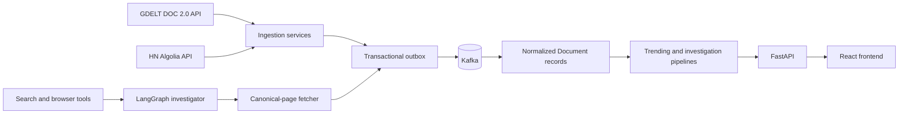

# RhetoriQ

RhetoriQ is an evidence-first narrative investigation system. It detects public narrative signals, retrieves source material, maps how language changes and spreads, and produces reports whose material claims point back to inspectable evidence.

The product deliberately distinguishes **first observed in the available dataset** from true origin and does not treat correlation as proof of coordination.

## What the current repository implements

- FastAPI endpoints for ingestion, trending topics, investigations, timelines, graphs, mutations, receipts, and reports.
- GDELT DOC 2.0 ingestion for news discovery.
- Hacker News ingestion through the public Algolia API.
- Direct HTTP retrieval of canonical pages for evidence enrichment.
- A durable LangGraph research runtime with budgets, leases, checkpoints, idempotent actions, replay, SSE progress, and a deterministic publication gate.
- Self-hosted SearXNG discovery plus GDELT, Hacker News, canonical HTTP, internal-corpus, and an isolated Playwright adapter for local research only.
- Federal Register first-party research with policy-aware receipts, retries, pagination, deduplication, and visible limitations.
- Apache Kafka KRaft and Apicurio Registry with six versioned JSON Schema topics, DLQs, transactional outbox, idempotent consumers, controlled replay, and Kafka-only investigation dispatch.
- In-memory and SQLite-backed development storage, with optional Redis caching, vector search, and agent memory.
- A React and TypeScript investigation interface with a live graph, research rail, evidence gate, and replay controls.
- Production container definitions for the Railway API/frontend deployment, committed PostgreSQL migrations, and CI checks for backend, frontend, documentation, and PostgreSQL migration compatibility.

B4 Flink and B5 Elasticsearch/Neo4j/MiniLM/Redis integration are implemented with runtime acceptance pending. B5 supplies recoverable projections, scoped search and provenance UI, operator commands and a local Compose overlay. See [B5 acceptance](docs/B5_ACCEPTANCE.md) and [local operations/B6 handoff](docs/B5_OPERATIONS.md). Kubernetes and the wider recurring-monitoring connector fleet remain later work. Corpus and B5 retrieval are opt-in until deployment qualification. Public launch evidence is tracked separately in [A5 launch evidence](docs/A5_LAUNCH_EVIDENCE.md). See [the roadmap](docs/ROADMAP.md) for exact implementation status.

## Research strategy

RhetoriQ is **agent-led and source-policy-first**, not crawler-first:

1. A user question starts a bounded investigation; the LangGraph investigator selects live broad-web search, internal-corpus recall, canonical-page retrieval, or an approved primary-source API for each evidence gap.
2. Search results and API records are discovery leads, not automatically evidence.
3. RhetoriQ retrieves a canonical source page when permitted and needed to create an evidence record, then preserves receipts and limitations.
4. RSS/Atom polling, public event streams, and other scheduled connectors are a later monitoring capability, not a prerequisite for answering a new question.

A website, post, transcript, or official record is a source. An API, feed, or HTML fetch is the transport used to retrieve it.

Current source status is documented in [DATA_SOURCES.md](docs/DATA_SOURCES.md).

## Current data flow



The implemented flow uses durable Kafka replay and PostgreSQL persistence. Later phases add recurring monitoring connectors, stream processing, and specialized search/graph stores without changing the normalized document contract.

## Repository layout

```text
rhetoriq/
|-- backend/
|   |-- agents/       # planning, retrieval, synthesis, and receipts
|   |-- api/          # FastAPI route modules
|   |-- models/       # shared Pydantic contracts
|   |-- services/     # ingestion, retrieval, analysis, and persistence
|   `-- tests/
|-- frontend/         # React, TypeScript, and Vite application
|-- docs/             # design and operating documentation
|-- SYSTEM_DESIGN.md
`-- README.md
```

## Local development

### Backend

```powershell
cd backend
python -m venv ..\.venv
..\.venv\Scripts\Activate.ps1
pip install -r requirements.txt
uvicorn main:app --reload
```

The API is available at `http://127.0.0.1:8000`; interactive documentation is at `/docs`.

### Frontend

```powershell
cd frontend
npm install
npm run dev
```

### Full B2/B3 stack

The root Compose stack supplies PostgreSQL/pgvector, Kafka, Apicurio Registry, SearXNG, topic initialization, the outbox publisher, event workers, API, and frontend:

```powershell
$env:POSTGRES_PASSWORD="<local-secret>"
$env:SEARXNG_SECRET="<local-secret>"
docker compose up --build -d
docker compose ps
```

See [Autonomous Research](docs/AUTONOMOUS_RESEARCH.md) for worker mode, model configuration, budgets, replay, and security boundaries.

### Tests

```powershell
pytest backend/tests
cd frontend
npm run build
```

## Important configuration

Settings are loaded from `backend/.env` when present.

| Variable | Purpose |
|---|---|
| `DEMO_MODE` | Use the bundled demo corpus and skip background live refreshes. |
| `GEMINI_API_KEY` | Optional Gemini model access. |
| `GROQ_API_KEY` | Optional Groq model access. |
| `RESEARCH_RUNTIME` | `auto`, `native`, or `langgraph` runtime selection. |
| `RESEARCH_EXECUTION_MODE` | Deployment label; execution is Kafka-only and defaults to `kafka`. |
| `KAFKA_BOOTSTRAP_SERVERS` | Kafka bootstrap addresses. |
| `KAFKA_SCHEMA_REGISTRY_URL` | Apicurio Confluent-compatible API base URL. |
| `KAFKA_CLIENT_ID` / `KAFKA_CONSUMER_GROUP_PREFIX` | Producer and consumer identity prefixes. |
| `KAFKA_SECURITY_PROTOCOL` | Kafka transport security protocol. |
| `KAFKA_SASL_USERNAME` / `KAFKA_SASL_PASSWORD` | Optional SASL credentials; never written to events or logs. |
| `KAFKA_TOPIC_PREFIX` | Optional environment-specific physical topic prefix. |
| `KAFKA_RETRY_MAX_ATTEMPTS` / `KAFKA_RETRY_BACKOFF_SECONDS` | Bounded consumer/producer retry policy. |
| `SEARXNG_BASE_URL` | Self-hosted broad-search endpoint. |
| `BROWSER_SERVICE_URL` | Isolated browser-rendering endpoint. |
| `BROWSER_RENDERING_ENABLED` | Keep `false` in the initial public deployment; enables the local browser adapter only when explicitly configured. |
| `DATABASE_URL` | PostgreSQL connection string for production persistence; use the managed Neon value and keep `sslmode=require` when supplied by Neon. |
| `DEPLOYMENT_ENV` | Set to `production` on the Railway API service; production startup requires `DATABASE_URL`. |
| `CORS_ALLOW_ORIGINS` | Comma-separated public frontend origin(s) allowed by the API. |
| `ENABLE_POSTGRES_VECTOR_SEARCH` | Feature flag for the additive Neon pgvector retrieval path; keep `false` until migration, backfill, and comparison checks pass. |
| `POSTGRES_VECTOR_SEARCH_TOP_K` | Maximum persisted semantic corpus results when the Neon path is enabled. |
| `POSTGRES_VECTOR_BACKFILL_BATCH_SIZE` | Resumable Neon corpus backfill batch size. |
| `REDIS_URL` | Optional Redis cache, phrase store, vector store, and memory. |
| `GDELT_BASE_URL` | GDELT DOC 2.0 endpoint. |
| `GDELT_MAX_RECORDS` | Maximum GDELT records requested per query. |
| `FETCH_TIMEOUT_SECONDS` | Canonical-page retrieval timeout. |

Future connectors must add their credentials only when implemented and approved. Reddit access, commercial search APIs, and licensed news products require terms and retention review before production use.

## Documentation

| Document | Purpose |
|---|---|
| [SYSTEM_DESIGN.md](SYSTEM_DESIGN.md) | Concise system principles and investigation lifecycle. |
| [ARCHITECTURE.md](docs/ARCHITECTURE.md) | Current and target architecture, including collection boundaries. |
| [DATA_SOURCES.md](docs/DATA_SOURCES.md) | Source hierarchy, provider status, and compliance requirements. |
| [SERVICES.md](docs/SERVICES.md) | Implemented service boundaries and planned connectors. |
| [KAFKA.md](docs/KAFKA.md) | Implemented replayable event contracts and operations. |
| [OPERATIONS.md](docs/OPERATIONS.md) | Kafka/outbox health, failure recovery, replay, retention, and secret runbook. |
| [INFRASTRUCTURE.md](docs/INFRASTRUCTURE.md) | Current deployment status and production principles. |
| [ROADMAP.md](docs/ROADMAP.md) | Delivery status and future phases. |
| [BACKEND.md](docs/BACKEND.md) | Backend contracts and endpoint reference. |
| [FRONTEND.md](docs/FRONTEND.md) | Frontend behavior and component model. |
| [TESTING.md](docs/TESTING.md) | Current verification commands and planned test layers. |
| [AUTONOMOUS_RESEARCH.md](docs/AUTONOMOUS_RESEARCH.md) | A2 architecture, setup, security, replay, and operating guide. |
| [TROUBLESHOOTING.md](docs/TROUBLESHOOTING.md) | Local runtime and optional-service troubleshooting. |
| [DEPLOYMENT.md](docs/DEPLOYMENT.md) | Live Railway deployment, environment configuration, and launch checks. |
| [A5_LAUNCH_EVIDENCE.md](docs/A5_LAUNCH_EVIDENCE.md) | Evidence checklist for public URLs, health checks, live investigation, reload, replay, and CI. |
