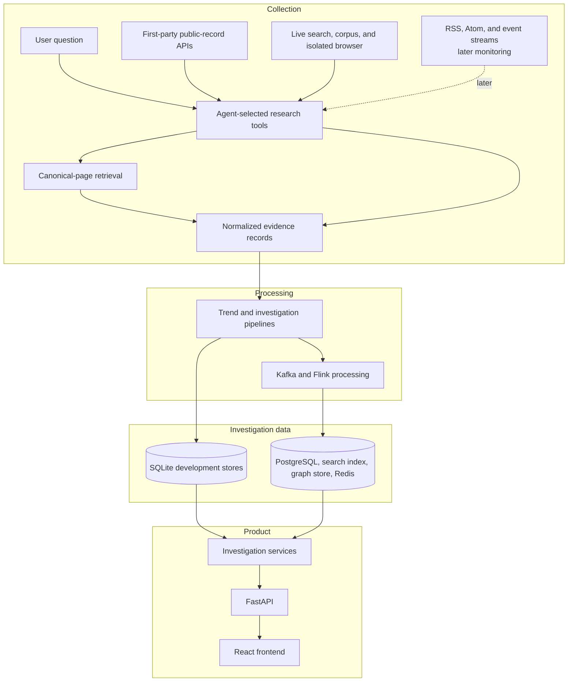

# RhetoriQ System Design

RhetoriQ is an evidence-first narrative investigation system. It identifies public narrative signals, preserves the source trail behind them, and gives users a workspace for examining spread, mutation, counter-frames, and uncertainty.

## Design principles

1. **Evidence before synthesis.** Reports must link material claims to retrievable source records.
2. **Observed is not proven.** The system says “first observed in the available dataset” and never treats correlation as proof of coordination.
3. **Autonomous but bounded research.** The LangGraph investigator selects approved self-operated search, browser, primary-source, and corpus tools per evidence gap; fixed budgets and source policy constrain every run.
4. **Transport is not source.** A publisher, public record, or social post is the source; an API, feed, search result, or page fetch is how it is acquired.
5. **Decomposed investigation.** Retrieval, timeline building, graph analysis, source-diversity analysis, and report synthesis are separate stages.
6. **Inspectable outputs.** Intermediate artifacts, limitations, provider coverage, and unresolved gaps remain visible.
7. **Durable processing.** Kafka events, transactional outbox delivery, Flink checkpoints, and idempotent consumers let layers recover independently.

## System flow

## Layer responsibilities

| Layer | Responsibility |
|---|---|
| Agent research tools | Search the live web, query approved primary sources, retrieve canonical pages, preserve receipts, and return normalized discovery or evidence records for a user question. |
| Scheduled monitoring connectors | Later capability for recurring feeds/streams; checkpoint progress, preserve provider metadata, and emit normalized discovery records. |
| Evidence retrieval | Fetch canonical pages when necessary, respecting access policy, and record retrieval outcomes. |
| Processing | Deduplicate, classify, extract phrases and entities, calculate embeddings, and detect signals. |
| Storage | Preserve documents, receipts, vectors, investigation state, and source relationships. |
| Investigative workflow | Select approved research tools, preserve a structured trail, and construct evidence-limited artifacts. |
| API | Provide stable interfaces for ingestion, investigations, narratives, and graph data. |
| Frontend | Present a narrative radar and inspectable investigation workspace. |

## Investigation lifecycle

1. A user submits a research question. Later, a scheduled monitoring connector may also create a candidate signal.
2. The planner converts the question into retrieval lanes and uncertainty requirements.
3. The current retriever follows the planner's retrieval lanes, normalizes canonical evidence where required, and records actions and failures as receipts or evidence gaps.
4. The LangGraph supervisor selects permitted search, primary-source, browser, or corpus tools based on the next evidence gap.
5. Deterministic stages build the timeline, narrative family, counter-frames, source-diversity summary, and spread graph.
6. A skeptic pass identifies unsupported conclusions and missing source classes.
7. The report synthesizer produces cautious findings and attaches receipts.
8. An evidence-threshold gate publishes a cited report or returns `insufficient_evidence`; the API persists and serves the investigation workspace.

See [docs/ARCHITECTURE.md](docs/ARCHITECTURE.md) for component-level boundaries and [docs/DATA_SOURCES.md](docs/DATA_SOURCES.md) for source policy.
