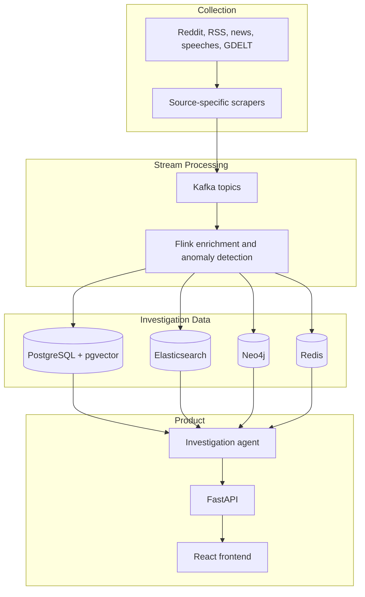

# RhetoriQ System Design

RhetoriQ is designed as an evidence-first narrative investigation system. It identifies public narrative signals, preserves the source trail behind them, and gives users a workspace for examining spread, mutation, counter-frames, and uncertainty.

## Design Principles

1. **Evidence before synthesis.** Reports must link material claims to retrievable source records.
2. **Observed is not proven.** The system uses language such as "first observed in the available dataset" and never treats correlation as proof of coordination.
3. **Decomposed investigation.** Retrieval, timeline building, graph analysis, source-diversity analysis, and report synthesis are separate stages.
4. **Inspectable outputs.** The product shows intermediate artifacts, limitations, and unresolved gaps alongside a final report.
5. **Durable processing.** Event streams and independently deployable services allow replay, scaling, and gradual improvement of each layer.

## System Flow

## Layer Responsibilities

| Layer | Responsibility |
|---|---|
| Ingestion | Retrieve public-source material and emit normalized raw events. |
| Kafka | Buffer, partition, retain, and replay source events. |
| Flink | Normalize text, extract entities, build embeddings, identify phrase spikes, and publish processed events. |
| Storage | Preserve documents, vectors, full-text indexes, source relationships, and fast investigation state. |
| Agent | Plan source-grounded research, query the appropriate stores, and construct an evidence-limited report. |
| API | Provide stable REST interfaces for investigations, narrative feeds, search, and graph data. |
| Frontend | Present a narrative radar and an inspectable investigation workspace. |

## Investigation Lifecycle

1. A signal is detected from source activity or a user submits a research question.
2. The planner converts the question into retrieval lanes and uncertainty requirements.
3. The retriever gathers documents, semantic neighbors, graph relationships, and source profiles.
4. Deterministic stages build a timeline, narrative family, counter-frames, source-diversity summary, and spread graph.
5. A skeptic pass identifies unsupported conclusions and evidence gaps.
6. The report synthesizer produces cautious findings and attaches receipts.
7. The API persists and serves the workspace to the frontend.

See the linked technical documents for the component-level contracts and operating model.
