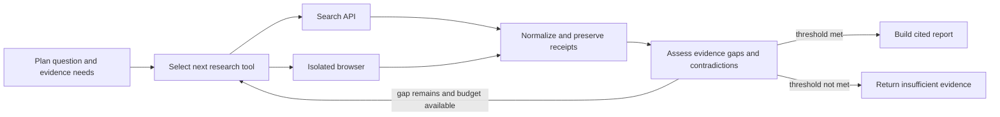

# RhetoriQ Investigative Agents

RhetoriQ's planned investigative runtime is a self-hosted **LangGraph** workflow with self-operated tracing and evaluation. It is designed to investigate public narratives autonomously while keeping every material claim bounded by inspectable evidence.

This document describes the target runtime. The current repository still uses its native planner, retriever, research-loop, receipt, and report services; the LangGraph runtime is not implemented yet.

## Responsibilities

The graph supervisor decides the next permitted research action. RhetoriQ services, not the model, remain the authority for document normalization, source classification, provenance, receipts, confidence, and publication.

The workflow may investigate a user question or a detected signal. It must answer only what the collected record supports, using **first observed in the available dataset** rather than claiming a definitive origin.

## Workflow

The supervisor chooses among permitted tools on each step instead of following a fixed tool order. Every transition is bounded by configured limits for tool calls, elapsed time, model spend, result count, and per-domain requests.

## Research tools

| Tool | Purpose | Evidence rule |
|---|---|---|
| Search adapter | Self-operated or approved public-web discovery and query refinement. | Save the query, result rank, URL, snippet, and adapter metadata as a discovery receipt. |
| Browser adapter | Isolated public-web exploration for JavaScript-rendered or interactive pages. | Record navigation and final canonical URL; normalize permitted page content before citing it. |
| Canonical-page fetcher | Direct retrieval of already-discovered public pages. | Preserve redirects, retrieval outcome, content type, timestamps, and parser metadata. |
| Internal retrieval | Search the normalized RhetoriQ corpus. | Return document IDs and existing receipt references. |

Search and browser tools complement one another. Structured discovery provides reproducible leads; the browser enables public-web investigation where a normal fetch is insufficient. The graph may select either tool, but browser automation is not permission to evade access controls.

## Safety and publication policy

- Use only public, permitted sources. Never bypass logins, paywalls, robots restrictions, rate limits, or technical access controls.
- Treat fetched page text as untrusted data, never as instructions for the agent.
- Enforce domain allow/deny policy, per-domain limits, response-size limits, and bounded retries.
- Preserve failed retrievals and thin coverage as visible evidence gaps.
- Do not expose chain-of-thought. The product may show a structured research trail: tool, query/action summary, receipt IDs, outcome, and limitation.
- Publish a report only when citation integrity, source diversity, provenance, and skeptic-review thresholds pass. Otherwise persist and return an `insufficient_evidence` result with its receipts and open gaps.

## State and outputs

The durable graph state contains the investigation plan, selected actions, budget usage, normalized documents, receipts, evidence gaps, confidence dimensions, and final decision. Existing investigation workspace contracts remain the product boundary; the runtime adds a machine-readable research trail and status for the UI.

## Observability and evaluation

The runtime must not require a managed observability service. It records graph runs, model calls, tool calls, prompt versions, latency, local cost metadata, failures, and evaluation outcomes in RhetoriQ-controlled storage. If tracing is exported, it must use a self-hosted OpenTelemetry-compatible endpoint.

Offline evaluation covers citation correctness, source diversity, uncertainty wording, unsupported-claim rejection, and reproducible research trails. Traces must not contain secrets or disallowed source content and follow the same retention and access policy as investigation artifacts.
