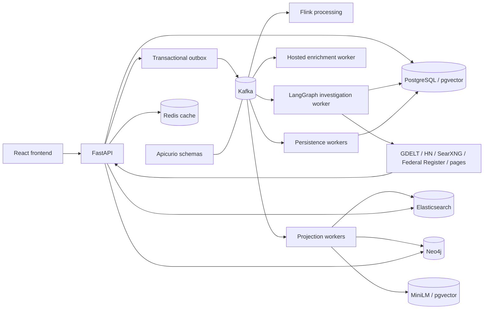
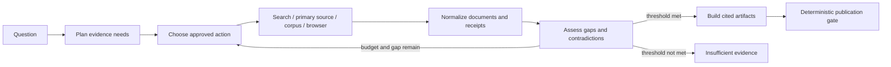
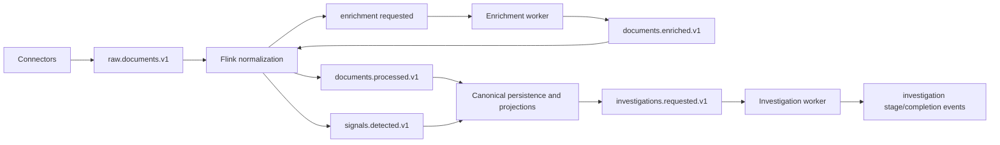

# RhetoriQ Architecture

RhetoriQ is an evidence-first narrative investigation system. It discovers
public material, preserves acquisition receipts, processes replayable events,
and presents cautious, inspectable investigations. The repository implements
the application, Kafka/Flink processing, and B5 projections; real B3–B5 runtime
qualification is still pending. Kubernetes and cloud automation are later
milestones.

## Design rules

1. **Evidence before synthesis.** Material claims link to retrievable records
   and exact evidence spans.
2. **Observed is not proven.** Product language says “first observed in the
   available dataset”; timing or graph proximity does not prove coordination.
3. **Autonomous but bounded research.** The investigator chooses only approved
   tools under time, request, result, domain, token, and spending budgets.
4. **Transport is not source.** A publisher, public record, speech, or post is a
   source; an API, feed, search result, or page fetch is an acquisition method.
5. **PostgreSQL is authoritative.** Search, graph, vector, and cache systems are
   derived views and never decide citation eligibility.
6. **Durable and inspectable processing.** Accepted work is persisted before it
   is published to Kafka; retries, gaps, limitations, and terminal decisions
   remain visible.

## Current topology

The root `compose.yml` supplies PostgreSQL/pgvector, Kafka, Apicurio, SearXNG,
the API, frontend, outbox publisher, role-scoped workers, and Flink. The B5
overlay adds authenticated Elasticsearch, Neo4j, Redis, local MiniLM inference,
projection initialization, and independent projection consumers. Code and
offline tests do not by themselves prove that the combined stack meets its
recovery or performance gates.

## Service boundaries

| Boundary | Responsibility |
| --- | --- |
| React frontend | Landing page, dashboard, live research progress, and persisted investigation workspace. |
| FastAPI | HTTP validation, durable reads, accepted writes, health, SSE, and stable product contracts. |
| Source connectors and research tools | Discover public records, retrieve permitted pages, normalize evidence, and preserve receipts. |
| Transactional outbox | Commit accepted domain mutations and outbound events atomically. |
| Kafka and Apicurio | Replayable delivery, versioned schemas, independent consumers, retries, and DLQs. |
| Flink | Stateful normalization, deduplication, event-time phrase windows, and narrative signals. |
| Enrichment worker | Hosted extraction and Gemini embeddings outside Flink checkpoints, with recorded artifacts and budgets. |
| Investigation worker | Durable LangGraph execution under a renewable database lease. |
| PostgreSQL/pgvector | Canonical documents, investigations, artifacts, revisions, receipts, checkpoints, outbox, and semantic corpus. |
| Elasticsearch | Derived lexical and literal-phrase evidence retrieval. |
| Neo4j | Derived, explained reference and provenance paths. |
| MiniLM worker | Local 384-dimensional semantic projection, separate from hosted Gemini embeddings. |
| Redis | Disposable bounded response cache and optional legacy cache/memory capabilities. |

The API never executes accepted ingestion or investigations synchronously.
Kafka or registry failure degrades readiness and grows the durable outbox; it
does not enable an unrecorded fallback.

## Acquisition and normalization

The current acquisition lanes are:

| Lane | Role | Evidence behavior |
| --- | --- | --- |
| GDELT DOC 2.0 | News discovery and signal input | Metadata and candidate URLs normally require canonical retrieval. |
| Hacker News via Algolia | Forum/story discovery | Story metadata is retained; linked pages require retrieval when cited. |
| SearXNG | Broad agent-selected discovery | Query, rank, URL, snippet, and provider receipt are preserved. |
| Federal Register | First-party public records | Official records can directly satisfy primary-source gaps. |
| Canonical HTTP fetch | Evidence enrichment | Redirects, final URL, content type, timestamps, parser version, and content hash are retained. |
| Isolated browser | Optional rendered-page retrieval | Public pages only; navigation and normalized output become a receipt. |

RSS/Atom and additional platform connectors remain future recurring-monitoring
work. Every transport maps into the shared `Document` boundary before analysis.
Source type describes the evidence (`national_news`, `forum`, `public_record`,
and so on), while provider and transport belong in metadata. See
[Data sources](DATA_SOURCES.md) for provider policy and status.

Discovery records are not automatically citable evidence. When a provider
returns only metadata or a snippet, the system retrieves the canonical page
where permitted. A failed retrieval remains visible as a limitation and cannot
silently gain the weight of a captured source.

## Investigation workflow

The self-hosted LangGraph runtime uses application-owned tool adapters and
state. It does not grant the model direct network or persistence authority.

Durable state includes the plan, selected actions, budget use, normalized
documents, receipts, gaps, checkpoints, evaluation, and terminal decision.
Fetched text is untrusted data, never agent instruction. Tools may access only
public, permitted sources and may not bypass authentication, paywalls, robots
restrictions, rate limits, or technical controls.

The product exposes a structured research trail—tool, action summary, receipt
IDs, outcome, and limitation—rather than private chain-of-thought. A report is
published only when citation integrity, source diversity, provenance, and
skeptic-review thresholds pass; otherwise the run ends as
`insufficient_evidence` with its open gaps.

## Claim and evidence verification

The optional A3 verifier is versioned and fail-closed. With
`CLAIM_VERIFIER_ENABLED=true`, new investigations record exact evidence spans,
semantic similarity, local NLI output, source role, independence group, date
confidence, reason codes, and final disposition. Existing reports change only
through explicit re-verification.

The configured local NLI model is required for affirmative verification. An
optional Gemini/Groq second opinion cannot override deterministic source,
span, independence, or disposition policy. Missing weights, invalid spans,
model failures, or insufficient independent evidence produce withheld or
unresolved results.

## Event and processing flow

Flink uses event time, bounded lateness, stable identifiers, recorded
enrichment artifacts, and checkpointed state. Hosted inference runs outside
Flink so provider latency cannot block checkpoints. Replays reuse immutable
artifacts; missing artifacts fail closed instead of silently calling a model or
changing semantic output. [Kafka](KAFKA.md) defines topics, envelopes,
retention, delivery, and replay details.

## Persistence and projections

PostgreSQL controls document eligibility, immutable revisions, withdrawals,
investigation snapshots, projection dispatch, and the active projection
generation. Specialized stores are rebuilt from retained canonical inputs:

- pgvector/MiniLM answers semantic-similarity questions;
- Elasticsearch supplies lexical and verified literal-phrase candidates;
- Neo4j supplies typed, explained paths between acquired records;
- Redis caches only complete validated responses and may be discarded.

Search results are rehydrated through PostgreSQL and checked for scope,
eligibility, revision, withdrawal, hashes, and model identity. Graph proximity
does not increase claim support. Gemini and MiniLM vectors remain separate
embedding spaces even though both use 384 dimensions.

## Live research event delivery

The SSE endpoint uses one process-local shared reader per active research run.
It reads durable events with a bounded read-only database path and serves all
subscribers without rebuilding the complete workspace on every poll.

- Subscribers replay history through the published watermark before receiving
  live events.
- Delivery is at least once; clients deduplicate by run ID and sequence.
- Terminal state and terminal events commit together, and streams drain the
  committed backlog before closing.
- Cache eviction, oversized events, and reconnects fall back to durable reads.
- Network sends hold neither a database connection nor the reader lock.
- Transient reads preserve cursors and retry with jitter; non-retryable failures
  close only the affected stream.

The research-trail API and workspace summary remain separate durable views.

## Security and deployment boundaries

Credentials belong in environment or platform secret stores and never in
events, DLQs, fixtures, documentation, or logs. B5 uses service-specific TLS
keys and a local CA; clients receive only the public trust material. Data-store
ports stay private or loopback-bound.

The implemented local stack is the application source of truth. B6 will map it
to Kubernetes Services, workloads, Jobs, probes, persistent volumes, ConfigMaps,
and Secrets. Terraform/GitOps, production observability, and the ephemeral AWS
showcase remain later roadmap work. See [Operations](OPERATIONS.md),
[Deployment](DEPLOYMENT.md), and the [Pre-B6 guide](PRE_B6_GUIDE.md).
