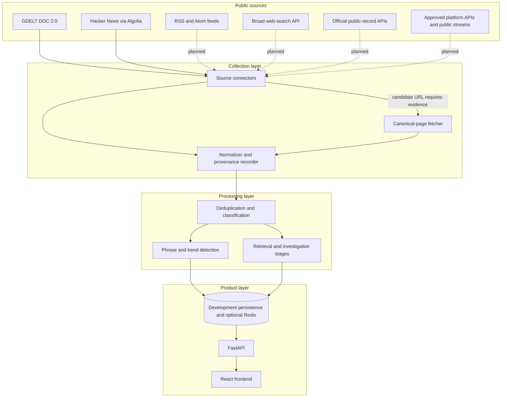
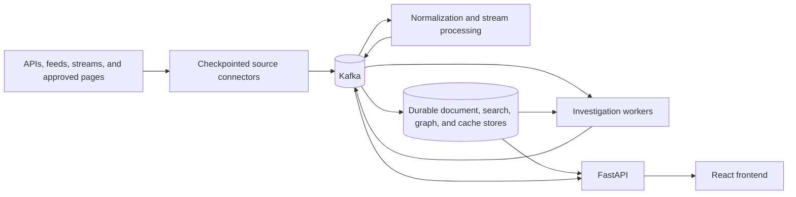
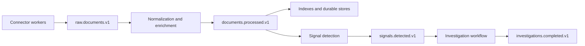

# RhetoriQ Architecture

This document defines the collection, processing, evidence, and product boundaries for RhetoriQ. It distinguishes the code that exists today from the distributed production architecture planned in the roadmap.

## Architecture status

### Implemented in this repository

- FastAPI application and React frontend.
- GDELT DOC 2.0 and Hacker News/Algolia ingestion.
- A normalized `Document` model and document normalizer.
- Direct HTTP page retrieval with timeout, content-type validation, redirect handling, and optional caching.
- An abstract `SearchProvider` boundary; live broad-web search is intentionally unconfigured.
- Trending detection, retrieval, timeline, graph, source-diversity, mutation, receipts, debate, and report services.
- SQLite and in-process development persistence, plus optional Redis-backed capabilities.

### Target production architecture

- Additional source connectors for feeds, search, public records, public event streams, and approved platforms.
- Durable connector checkpoints and idempotent ingestion.
- Kafka contracts and replayable processing.
- Stream processing and durable production stores.
- Independently scalable connector workers and processing services.
- Production secrets, observability, and compliance controls.

Kafka, Flink, Kubernetes, PostgreSQL/pgvector, Elasticsearch, and Neo4j should not be described as already implemented until their roadmap phases are complete.

## Core collection rule

RhetoriQ is **API/feed-first**.

Acquisition priority is:

1. First-party APIs and official bulk datasets.
2. RSS, Atom, JSON Feed, webhooks, or public event streams.
3. A licensed or terms-compatible search API for broad discovery.
4. Direct retrieval of a canonical public page for evidence enrichment.
5. Browser automation only when an important source has no structured interface and cannot be retrieved with a normal HTTP client.

“Scraper” is not used as the umbrella term. The umbrella is **source connector**. A connector may use an API, feed, stream, file download, or controlled page fetch.

## High-level flow

Kafka remains the production event backbone. The first diagram shows the current development runtime; the second shows the target production topology.



### Target production topology



Kafka provides durable replay, back-pressure, failure isolation, and independent scaling. Source connectors do not call processing or investigation workers directly in this topology.

## Collection responsibilities

### Discovery versus evidence

Discovery APIs answer “which records or URLs might matter?” They are not automatically the evidence used in a report.

When a provider returns only a title, URL, or snippet, RhetoriQ should retrieve the canonical source where permitted and store:

- provider and query;
- provider rank or score;
- original and final canonical URL;
- source-native identifier;
- title, author, and publication timestamp;
- collection timestamp;
- extracted text or permitted excerpt;
- retrieval status and content type;
- content hash and parser version;
- applicable retention or deletion policy.

If the canonical page cannot be retrieved, the provider result may remain a discovery record, but the limitation must be visible and its evidentiary weight reduced.

### Connector contract

Every production connector should expose equivalent behavior even when transports differ:

```python
class SourceConnector(Protocol):
    name: str
    capabilities: ConnectorCapabilities

    def collect(self, request: CollectionRequest) -> CollectionBatch: ...
    def checkpoint(self) -> ConnectorCheckpoint: ...
```

Capabilities should include:

- `supports_history`;
- `supports_incremental_sync`;
- `supports_full_text`;
- `supports_streaming`;
- `requires_canonical_fetch`;
- `rate_limit_policy`;
- `retention_policy`;
- `deletion_sync_policy`.

### Failure isolation

Connectors fail independently. A Reddit authorization failure, dead RSS feed, GDELT throttle, or canonical-page timeout must not stop other collection lanes. Each batch reports partial success, provider-specific errors, retryability, and the last committed checkpoint.

## Current connectors

| Connector | Transport | Current role | Full text |
|---|---|---|---|
| GDELT | DOC 2.0 JSON API | News discovery and trend signals | No; current mapping uses title/snippet and canonical URL. |
| Hacker News | Algolia HN Search API | Community/forum discovery | Story metadata and title; linked pages require canonical fetch. |
| Canonical page | Direct HTTP GET | Evidence enrichment after discovery | Extracted from retrievable HTML. |
| Broad web search | `SearchProvider` interface | Planned discovery and enrichment lanes | Provider-dependent; canonical fetch normally required. |

The current trending detector polls a fixed seed-topic list. Production discovery should add broader query generation and connector-specific incremental collection rather than treating those seeds as complete coverage.

## Planned connector order

1. Implement one broad web-search provider behind the existing `SearchProvider` interface.
2. Add an RSS/Atom connector with ETag, `Last-Modified`, and item-ID checkpoints.
3. Add first-party public-record connectors such as Congress.gov and Federal Register.
4. Add Bluesky Jetstream or equivalent public event streams where their terms fit the product.
5. Add Reddit only through approved official API access, with deletion and retention handling.
6. Add video or speech metadata through first-party APIs; use official transcripts or licensed caption access rather than assuming a public C-SPAN transcript API.

NewsAPI may be evaluated as a supplemental discovery provider, but it is not the default evidence store and must not be described as a production dependency without a suitable paid license and content-use review.

## Normalized document boundary

All transports map into the shared `Document` contract before analysis. Important fields include source identity, source type, canonical URL, publication and collection timestamps, text/snippet, entities, phrases, and provider metadata.

Source types describe the nature of the evidence (`national_news`, `local_news`, `forum`, `blog`, `commentary`, `speech_transcript`), not the transport used to acquire it. Provider names such as `gdelt` or `brave_search` belong in metadata.

## Processing and investigation

After normalization, deterministic services perform:

- deduplication and source classification;
- phrase extraction and spike scoring;
- semantic retrieval and source-diversity measurement;
- timeline and provenance construction;
- narrative-family and mutation analysis;
- counter-frame and skeptic analysis;
- receipt generation and final report assembly.

The system must preserve caveats from collection through synthesis. Provider coverage, failed fetches, missing official sources, uncertain dates, and duplicate syndication all affect confidence.

## Target Kafka event architecture

Kafka is the planned durable production boundary, not the definition of a source connector:



A single versioned raw-document topic is preferred unless volume, retention, security, or ordering requirements justify source-specific topics. The event includes `provider`, `transport`, and `source_type`, so downstream consumers do not depend on connector deployment names.

See [KAFKA.md](KAFKA.md) for the planned event contracts.

## Storage evolution

Development uses lightweight persistence so the product can run locally. The production target separates access patterns:

- PostgreSQL for durable documents and investigation artifacts;
- pgvector or an equivalent vector index for semantic retrieval;
- a full-text index when PostgreSQL search is insufficient;
- a graph store only when graph queries justify its operational cost;
- Redis for caches, ephemeral state, rate-limit coordination, and optional vector/memory features.

These stores are implementation choices, not evidence sources. Canonical provenance remains in the normalized document and receipt contracts.

## Security, compliance, and retention

Before enabling a connector in production:

- review provider terms and intended commercial use;
- document allowed storage, display, and redistribution;
- implement credential isolation and rotation;
- respect robots and access controls for direct retrieval;
- identify personal-data and deletion obligations;
- define retention and revalidation rules;
- record parser and connector versions for auditability.

No connector may bypass authentication, paywalls, technical access controls, or provider rate limits.

## Technology decisions

| Decision | Choice | Reason |
|---|---|---|
| Collection abstraction | Capability-based source connectors | Keeps APIs, feeds, streams, and fetches behind one normalized boundary. |
| Default acquisition | APIs and feeds | More stable metadata, clearer identifiers, and lower operational fragility. |
| Broad discovery | Pluggable search provider | Avoids coupling investigations to one vendor. |
| Evidence enrichment | Canonical HTTP retrieval | Preserves the source page behind aggregator metadata when permitted. |
| Browser automation | Last-resort adapter | High cost and fragility make it unsuitable as the default. |
| Production messaging | Versioned Kafka events, planned | Enables replay and independent scaling without leaking deployment names into schemas. |
| Evidence language | “First observed in our dataset” | Coverage cannot prove true origin. |
