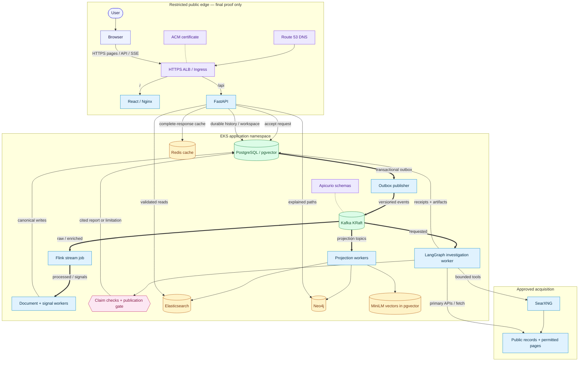
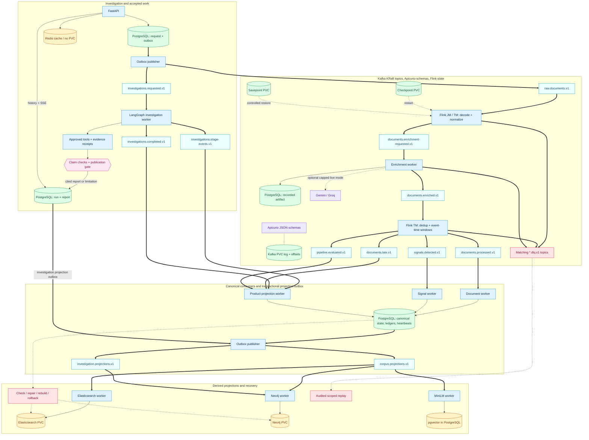
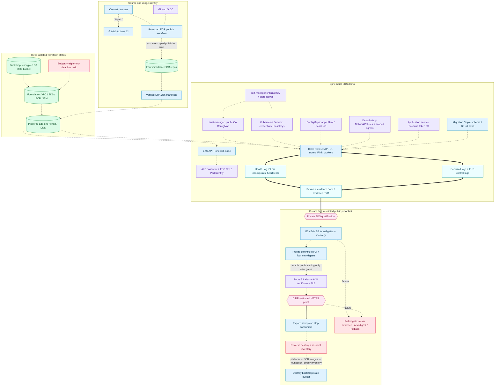

# RhetoriQ Architecture

RhetoriQ is an evidence-first narrative investigation system. It discovers
public material, preserves acquisition receipts, processes replayable events,
and presents cautious, inspectable investigations. The repository contains the
application, Kafka/Flink processing, B5 projections, a B6 Helm chart, and
guarded AWS automation. The diagrams below connect those components into the
end-to-end AWS architecture.

## Design rules

1. **Evidence before synthesis.** Material claims link to retrievable records
   and exact evidence spans.
2. **Observed is not proven.** Product language says “first observed in the
   available dataset”; timing or graph proximity does not prove coordination.
3. **Autonomous but bounded research.** The investigator chooses only approved
   tools under time, request, result, domain, token, and spending budgets.
4. **Transport is not source.** A publisher, public record, speech, or post is a
   source; an API, feed, search result, or page fetch is an acquisition method.
5. **PostgreSQL is authoritative.** Search, graph, vector, and cache systems are
   derived views and never decide citation eligibility.
6. **Durable and inspectable processing.** Accepted work is persisted before it
   is published to Kafka; retries, gaps, limitations, and terminal decisions
   remain visible.

## End-state architecture

These three views show the same demo-scale design at different levels. The EKS
profile starts with application Ingress disabled. Route 53, ACM, and the
CIDR-restricted public ALB path form the restricted release stage. The Helm
chart uses one node and one replica for the EKS showcase.

The root `compose.yml` supplies the base Kafka/Flink application stack; the B5
Compose overlay adds the specialized stores and projection consumers. The B6
Helm chart maps that combined topology to `kind` and the ephemeral EKS profile.

### 1. Executive end-to-end view

The public entry uses one hostname with `/` to the frontend and `/api` to the
API; browser SSE is a long-lived API response through the same ALB. The
frontend does not receive direct access to stores or workers. Green cylinders
are authoritative or replayable durable state. Amber cylinders are derived
views; Redis is disposable. MiniLM writes a separate local 384-dimensional
projection into PostgreSQL/pgvector; it is not the hosted Gemini embedding
space and it does not become a second authority.

### 2. Runtime, event processing, and recovery

The topic nodes share the Kafka KRaft log; they are not separate databases.
Repeated PostgreSQL cylinders show different roles of the **same** canonical
database, and the two outbox-publisher boxes show the same worker at two points
in the lifecycle. Each of the 12 primary topics has a corresponding DLQ
schema/topic. Flink owns
raw and enriched processing. Beyond-lateness records go to audit without
changing the active signal window. Enrichment happens outside checkpoints;
recorded artifacts preserve replay semantics, and missing replay artifacts fail
closed. The Flink JobManager schedules the job, while the TaskManager executes
normalization and event-time window branches. Live provider calls require
explicit budgets and approval.

PostgreSQL holds canonical documents, revisions, withdrawals, investigation
state, receipts, enrichment artifacts, outbox, consumer ledgers, worker
heartbeats, projection snapshots, and the active generation manifest. Its EKS
volume, Kafka logs, Elasticsearch and Neo4j data, and Flink checkpoint/savepoint
volumes are persistent EBS claims. The evidence Job has a separate evidence
claim. A consumer commits its Kafka offset only after its durable side effect;
bounded retries lead to a sanitized DLQ. Replay uses an audited, separate
consumer identity. Projection check/repair, generation rebuild, atomic cutover,
and rollback read canonical inputs. API reads rehydrate candidates against
PostgreSQL eligibility and revision rules; Redis failure simply misses. Search
or graph failure produces labeled limited fallbacks, never a false healthy view.
The chart has no standalone cache worker: the API owns Redis response caching.
Apicurio has no chart PVC. The topic/schema init Job registers committed
schemas at deployment; a registry restart requires a schema availability check
before consumers resume.

### 3. Deployment, trust, qualification, and teardown

The bootstrap state is local while it creates the encrypted, versioned S3
bucket; foundation and platform use isolated remote states. Foundation creates
the constrained EKS API endpoint, one node, four immutable ECR repositories,
operator access, Pod Identity roles, and the budget. Platform installs
cert-manager, trust-manager, the ALB controller, encrypted gp3 storage, and the
Helm release. GitHub OIDC scopes the image publisher to this repository,
protected environment, workflow, `main`, and four ECR repositories; the EKS
node pulls images by verified manifest digest. The application service account
does not mount an API token; the ALB controller and EBS CSI use their own Pod
Identity boundaries. Kubernetes Secrets hold credentials and service leaf keys;
trust-manager distributes only the public internal CA. Store connections use
verified TLS. Kafka and Apicurio use private in-cluster plaintext/HTTP
listeners protected by NetworkPolicies.

### Diagram legend

| Mark | Meaning |
| --- | --- |
| Indigo | User or browser actor. |
| Blue | Application service, worker, job, or runtime process. |
| Green cylinder | Durable canonical state, replay log, persistent checkpoint/savepoint, or Terraform/image identity state. PostgreSQL alone is the canonical business store. |
| Amber cylinder | Derived Elasticsearch/Neo4j/vector view or disposable Redis cache; rebuild or invalidate from canonical inputs. |
| Cyan | Logical event topic or operational evidence/telemetry artifact. |
| Pink diamond or node | Decision, verification, release gate, or published report. |
| Violet | Edge, identity, certificate, schema, policy, or trust control. |
| Rose | Failure, limitation, DLQ, replay/repair, deadline, or teardown action. |
| Solid arrow `-->` | Synchronous request, direct read/write, or immediate processing step. |
| Thick arrow `==>` | Asynchronous event delivery or collected evidence/feedback. |
| Dashed arrow `-.->` | Deployment/control/recovery action; labels identify optional external calls. |
| Dashed line `-.-` | Trust/configuration relationship, without implying a data transfer. |

### Lifecycle walkthrough

1. A candidate commit passes local regression; the frozen final release also
   passes full CI. A protected GitHub Actions dispatch checks the exact source
   SHA on `main`, assumes a scoped AWS role through OIDC, builds
   four Linux/AMD64 images, verifies ECR manifest SHA-256 digests, and packages
   digest-only Helm values.
2. Guarded Terraform plans create bootstrap, foundation, then platform state.
   The initial EKS release is private. Migration, topic/schema, and B5 init Jobs
   precede long-running workloads; external Secrets and internal CA trust are
   in place before clients start.
3. A user submits an investigation through the API. PostgreSQL commits the
   accepted request and outbox row together. The publisher sends the request
   to Kafka; the LangGraph worker leases it, uses only approved bounded tools,
   and saves plans, receipts, gaps, checkpoints, and progress.
4. Acquired material enters the raw-document stream. Flink normalizes and
   requests enrichment; the default recorded-provider worker returns immutable
   artifacts. Flink deduplicates, updates event-time phrase windows, and emits
   processed documents, signals, late-event audits, and freshness evaluations.
5. Document and signal consumers update canonical corpus and signal state.
   The investigation worker persists reports and ordered stage/completion
   events; the product projection worker records delivery and freshness.
   Projection events feed the independent Elasticsearch, Neo4j, and MiniLM
   workers. API retrieval checks candidates against current PostgreSQL
   eligibility before display.
6. The investigator builds cited artifacts. Optional A3 verification checks
   exact spans, local NLI, independence, and contradictions; deterministic
   publication policy returns a cited report or `insufficient_evidence` with
   limitations. SSE replays durable progress and the workspace survives reload.
7. On failure, outbox rows remain pending, consumers retry or DLQ, and
   checkpoints/savepoints support controlled Flink recovery. Audited replay,
   projection repair/rebuild, generation rollback, and explicit degraded reads
   preserve source and release identities. Qualification retains counts,
   lag/DLQs, heartbeats, checkpoints, sanitized logs, and recovery evidence.
8. Formal B3–B5 gates and a frozen release must pass before CIDR-restricted
   Route 53/ACM/ALB HTTPS proof. After evidence export, teardown requests a
   savepoint, stops consumers, destroys platform, deletes ECR images, destroys
   foundation, checks residual AWS resources, and only then destroys bootstrap.
   A failed gate retains its evidence; repository fixes require a new immutable
   commit and digest, while a compatible prior image can be rolled back through
   a reviewed plan.

## Service boundaries

| Boundary | Responsibility |
| --- | --- |
| React frontend | Landing page, dashboard, live research progress, and persisted investigation workspace. |
| FastAPI | HTTP validation, durable reads, accepted writes, health, SSE, and stable product contracts. |
| Source connectors and research tools | Discover public records, retrieve permitted pages, normalize evidence, and preserve receipts. |
| Transactional outbox | Commit accepted domain mutations and outbound events atomically. |
| Kafka and Apicurio | Replayable delivery, versioned schemas, independent consumers, retries, and DLQs. |
| Flink | Stateful normalization, deduplication, event-time phrase windows, and narrative signals. |
| Enrichment worker | Hosted extraction and Gemini embeddings outside Flink checkpoints, with recorded artifacts and budgets. |
| Investigation worker | Durable LangGraph execution under a renewable database lease. |
| PostgreSQL/pgvector | Canonical documents, investigations, artifacts, revisions, receipts, checkpoints, outbox, and semantic corpus. |
| Elasticsearch | Derived lexical and literal-phrase evidence retrieval. |
| Neo4j | Derived, explained reference and provenance paths. |
| MiniLM worker | Local 384-dimensional semantic projection, separate from hosted Gemini embeddings. |
| Redis | Disposable bounded response cache and optional legacy cache/memory capabilities. |

The API never executes accepted ingestion or investigations synchronously.
Kafka or registry failure degrades readiness and leaves accepted work in the
durable outbox for retry.

## Acquisition and normalization

The current acquisition lanes are:

| Lane | Role | Evidence behavior |
| --- | --- | --- |
| GDELT DOC 2.0 | News discovery and signal input | Metadata and candidate URLs normally require canonical retrieval. |
| Hacker News via Algolia | Forum/story discovery | Story metadata is retained; linked pages require retrieval when cited. |
| SearXNG | Broad agent-selected discovery | Query, rank, URL, snippet, and provider receipt are preserved. |
| Federal Register | First-party public records | Official records can directly satisfy primary-source gaps. |
| Canonical HTTP fetch | Evidence enrichment | Redirects, final URL, content type, timestamps, parser version, and content hash are retained. |
| Isolated browser | Optional rendered-page retrieval | Public pages only; navigation and normalized output become a receipt. |

RSS/Atom and additional platform connectors remain future recurring-monitoring
work. Every transport maps into the shared `Document` boundary before analysis.
Source type describes the evidence (`national_news`, `forum`, `public_record`,
and so on), while provider and transport belong in metadata. See
[Data sources](DATA_SOURCES.md) for provider policy and status.

Discovery records are not automatically citable evidence. When a provider
returns only metadata or a snippet, the system retrieves the canonical page
where permitted. A failed retrieval remains visible as a limitation and cannot
silently gain the weight of a captured source.

## Investigation workflow

The self-hosted LangGraph runtime uses application-owned tool adapters and
state. It does not grant the model direct network or persistence authority.

The investigation branch of the runtime diagram above expands the path from
accepted request through bounded tool calls, evidence artifacts, optional A3
verification, and the deterministic publication gate.

Durable state includes the plan, selected actions, budget use, normalized
documents, receipts, gaps, checkpoints, evaluation, and terminal decision.
Fetched text is untrusted data, never agent instruction. Tools may access only
public, permitted sources and may not bypass authentication, paywalls, robots
restrictions, rate limits, or technical controls.

The product exposes a structured research trail—tool, action summary, receipt
IDs, outcome, and limitation—rather than private chain-of-thought. A report is
published only when citation integrity, source diversity, provenance, and
skeptic-review thresholds pass; otherwise the run ends as
`insufficient_evidence` with its open gaps.

## Claim and evidence verification

The optional A3 verifier is versioned and fail-closed. With
`CLAIM_VERIFIER_ENABLED=true`, new investigations record exact evidence spans,
semantic similarity, local NLI output, source role, independence group, date
confidence, reason codes, and final disposition. Existing reports change only
through explicit re-verification.

The configured local NLI model is required for affirmative verification. An
optional Gemini/Groq second opinion cannot override deterministic source,
span, independence, or disposition policy. Missing weights, invalid spans,
model failures, or insufficient independent evidence produce withheld or
unresolved results.

## Event and processing flow

The runtime diagram names the 12 primary topic families, their matching DLQs,
the Flink branches, and the distinct persistence and projection consumers.

Flink uses event time, bounded lateness, stable identifiers, recorded
enrichment artifacts, and checkpointed state. Hosted inference runs outside
Flink so provider latency cannot block checkpoints. Replays reuse immutable
artifacts; missing artifacts fail closed instead of silently calling a model or
changing semantic output. [Kafka](KAFKA.md) defines topics, envelopes,
retention, delivery, and replay details.

## Persistence and projections

PostgreSQL controls document eligibility, immutable revisions, withdrawals,
investigation snapshots, projection dispatch, and the active projection
generation. Specialized stores are rebuilt from retained canonical inputs:

- pgvector/MiniLM answers semantic-similarity questions;
- Elasticsearch supplies lexical and verified literal-phrase candidates;
- Neo4j supplies typed, explained paths between acquired records;
- Redis caches only complete validated responses and may be discarded.

Search results are rehydrated through PostgreSQL and checked for scope,
eligibility, revision, withdrawal, hashes, and model identity. Graph proximity
does not increase claim support. Gemini and MiniLM vectors remain separate
embedding spaces even though both use 384 dimensions.

## Live research event delivery

The SSE endpoint uses one process-local shared reader per active research run.
It reads durable events with a bounded read-only database path and serves all
subscribers without rebuilding the complete workspace on every poll.

- Subscribers replay history through the published watermark before receiving
  live events.
- Delivery is at least once; clients deduplicate by run ID and sequence.
- Terminal state and terminal events commit together, and streams drain the
  committed backlog before closing.
- Cache eviction, oversized events, and reconnects fall back to durable reads.
- Network sends hold neither a database connection nor the reader lock.
- Transient reads preserve cursors and retry with jitter; non-retryable failures
  close only the affected stream.

The research-trail API and workspace summary remain separate durable views.

## Security and deployment boundaries

Credentials belong in environment or platform secret stores and never in
events, DLQs, fixtures, documentation, or logs. B5 uses service-specific TLS
keys and a local CA; clients receive only the public trust material. Data-store
ports stay private or loopback-bound.

The local stack and B6 chart define the topology above. See
[Operations](OPERATIONS.md), [Deployment](DEPLOYMENT.md), and
[B6 Operations](B6_OPERATIONS.md) for the execution procedures.
