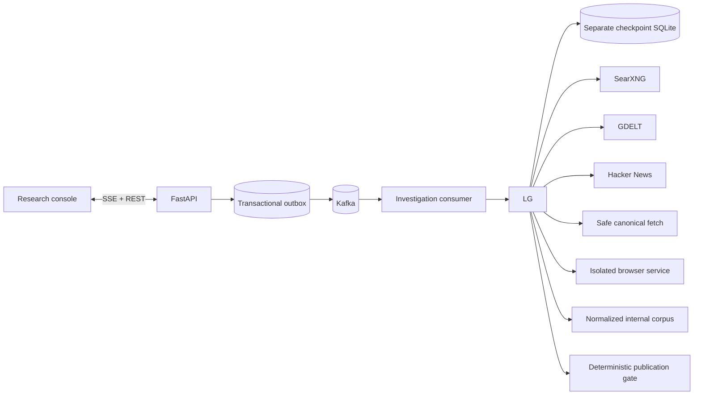

# A2 Autonomous Research Runtime

A2 is RhetoriQ's durable, auditable internet-research runtime. It uses LangGraph as a low-level state graph, not a hosted agent platform. Application code owns every tool permission, URL decision, budget, normalized document, receipt, and publication threshold.

## Runtime topology



The graph explicitly initializes, assesses evidence, selects and validates one structured action, dispatches through an approved adapter, normalizes results, and loops until a bounded evidence packet is ready. It then runs the existing evidence-artifact pipeline and deterministic publication gate.

## Local startup

Install the backend dependencies, configure local secrets, then start the full event stack:

```powershell
$env:POSTGRES_PASSWORD="<local-secret>"
$env:SEARXNG_SECRET="<local-secret>"
docker compose up --build -d
docker compose ps
```

Check `GET /api/research/health` before a live demo. A hosted model requires a Gemini or Groq key. Ollama is supported through `OLLAMA_BASE_URL` and `OLLAMA_MODEL`; it consumes model/token budgets but contributes zero hosted spend.

The built-in price registry recognizes `gemini-2.5-flash` and Groq `openai/gpt-oss-20b`. A different hosted model is rejected unless its input/output prices are explicitly configured and `RESEARCH_ALLOW_CUSTOM_MODEL_PRICING=true` is set.

## Durability and replay

The API persists `queued` and `investigations.requested.v1` in one transaction before returning HTTP 202. The Kafka worker claims the run using a short database transaction and a renewable lease. Every graph action receives a stable idempotency key derived from its run, action position, and validated decision. On recovery, completed actions are reconstructed from persisted receipts and are not repeated.

LangGraph checkpoints live in `RESEARCH_CHECKPOINT_DB_PATH`; public audit records live alongside the investigation database. A recorded replay creates a child run, disables new network/model decisions, copies recorded actions and normalized documents, recomputes deterministic artifacts and the gate, and stores an equivalence comparison.

## Evidence and security boundary

- Only HTTP and HTTPS public destinations are permitted; credentials in URLs and local, private, reserved, multicast, loopback, or link-local addresses are rejected.
- Canonical redirects and browser subrequests are revalidated. Robots rules, byte/time/redirect/domain budgets, content types, access controls, and failures remain visible as receipts.
- The browser container runs Chromium as a non-root process with a read-only filesystem, temporary storage, dropped capabilities, resource limits, no application mounts, and a fresh context per request.
- Search snippets and page text are untrusted evidence. They never become tool instructions or alter policy, budgets, prompts, or publication code.
- Public events contain identifiers and user-safe summaries only. Raw prompts, secrets, full HTML, and hidden reasoning are excluded.

The browser is intentionally limited to public navigation and extraction: no login, forms, CAPTCHAs, uploads, downloads, paywall bypass, persistent storage, or model-supplied JavaScript.

## Publication discipline

Candidate artifacts are constructed before the gate, but the public report is saved only if all deterministic checks pass: skeptic approval; no blocking evidence gaps; at least three canonical sources across two domains and two source classes; complete verified citations for every material claim; no rejected or unresolved surviving claim; and intent-aware chronology/provenance requirements. Failure deletes/withholds the public report while preserving the evidence packet, receipts, trail, gate reasons, and recommended checks.

## Verification and rollback

Run the A2 scorecard and test suite:

```powershell
cd backend
..\.venv\Scripts\python.exe -m evaluation.a2_benchmark --check
..\.venv\Scripts\python.exe -m pytest tests
```

`RESEARCH_RUNTIME=native` may select the established supervised research engine inside the Kafka investigation worker; it does not restore synchronous API execution. A live portfolio recording should demonstrate Kafka/registry and provider health, multi-tool execution, intentional interruption/resume, a published case, and a withheld case.
