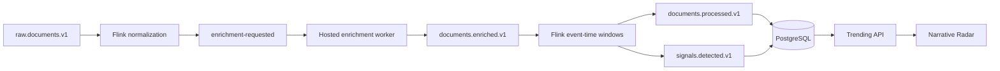

# B4 Final-Product Sprint: Flink Processing and Narrative Signals

## Summary

Deliver B4 as one milestone-gated sprint: each vertical slice includes implementation, tests, integration checks, and operational hardening, followed by a final stabilization gate. No separate calendar estimate is assigned.

B4 starts from the existing B3 Kafka/Apicurio backbone; the current synchronous document handler will be replaced by a real Flink pipeline, and stream-generated narrative signals will become the dashboard’s primary feed.

## Implementation Changes

### 1. Runtime and processing contracts

- Build a pinned Flink 2.3.0 application cluster in Compose with one JobManager, one TaskManager, four slots, parallelism two, persistent checkpoint volume, health checks, and the Flink UI on host port `8082`.
- Use a dedicated Python 3.12 PyFlink image because Flink 2.3 supports Python through 3.12, while the existing API remains on Python 3.13. [Apache Flink 2.3 prerequisites](https://nightlies.apache.org/flink/flink-docs-release-2.3/docs/getting-started/local_installation/)
- Add `documents.enrichment-requested.v1`, `documents.enriched.v1`, and `documents.late.v1`; add DLQs for the two consumed enrichment topics.
- Increase raw-event retention to 14 days so the seven-day baseline can be rebuilt. Retain enriched/processed documents for 30 days and signals for 90 days.
- Replace the production raw-document consumer with the Flink job. The existing Python normalization code becomes reusable pure logic and fixture support, avoiding competing consumers.
- Use Kafka transactional sinks and exactly-once Flink checkpoints every 60 seconds. Stable event IDs and semantic output hashes must make replay idempotent; `produced_at` may differ, but payloads, IDs, and output hashes may not. [Flink fault-tolerance guarantees](https://nightlies.apache.org/flink/flink-docs-stable/docs/connectors/datastream/guarantees/)

### 2. Deterministic hosted enrichment

- Normalize Unicode, whitespace, control characters, URLs, source classification, language, timestamps, and exact-content hashes before requesting inference.
- Run hosted calls in an independently scalable enrichment worker, not inside a Flink operator, so provider latency and retries do not block checkpoints.
- Use Gemini as primary for schema-constrained entity/phrase extraction and embeddings. Groq is the structured-extraction fallback; Gemini remains mandatory for embeddings.
- Pin `gemini-embedding-001` at 384 dimensions to remain compatible with the current pgvector corpus. Normalize vectors before storage. [Gemini embeddings documentation](https://ai.google.dev/gemini-api/docs/embeddings)
- Extraction returns at most 20 entities and 20 canonical phrases, including surface forms and evidence offsets. Reject phrases whose cited surface form is not present in the normalized text.
- Persist immutable enrichment artifacts keyed by input hash, pipeline version, provider, model, prompt version, and output schema. Store the validated result, embedding, output hash, usage, and failure state without secrets.
- Replay reads recorded artifacts only. A missing artifact fails closed and requires an explicit operator re-enrichment command.
- Default failure policy is three bounded attempts within 60 seconds, followed by the enrichment DLQ. No partially enriched document may influence a signal.
- Production startup requires explicit hosted-model request-rate and spending budgets; exhausted budgets pause consumption and surface degraded health rather than silently changing models.

### 3. Event time, anomaly detection, and signal lifecycle

- Use `published_at` as event time; fall back to `collected_at` with a quality flag. Future-invalid publication times fall back to collection time.
- Configure a 15-minute bounded-out-of-order watermark, one-minute idle-partition timeout, and 24-hour allowed lateness.
- Late events within 24 hours revise affected windows using stable signal IDs and incremented revisions. Older valid events go to `documents.late.v1` for audit and never silently mutate current signals.
- Deduplicate exact content hashes in keyed state with a 14-day TTL and preserve `duplicate_of_document_id`.
- Calculate two horizons:
  - Emerging: six-hour sliding window, evaluated every 15 minutes.
  - Sustained: 24-hour sliding window, evaluated hourly.
- Compare each horizon with aligned buckets from the previous seven days. Spike score is `observed unique documents / max(1, mean baseline count)`.
- Publish only when there are at least four documents, three publishers, two source types, a 2× spike, and confidence of at least 0.65.
- Reuse the current deterministic confidence inputs and weights: document volume, publisher diversity, source-type diversity, baseline persistence, spike strength, and multi-provider coverage. Preserve the existing Low/Medium/High labels.
- Merge six-hour and 24-hour results into one topic lifecycle keyed by canonical phrase. Expose both horizon metrics while preventing duplicate dashboard cards.
- Keep `auto_investigate=false` by default. Users launch investigations through the existing action; guarded automatic scheduling remains an off-by-default configuration.

### 4. Persistence, API, and frontend cutover

- Add idempotent PostgreSQL projections for enrichment artifacts, processed-document lineage, signal revisions, horizon metrics, supporting documents, limitations, and evaluation heartbeats.
- Extend `documents.processed.v1` with an optional enrichment receipt and semantic output hash.
- Extend `signals.detected.v1` with horizon, revision, lifecycle status, scoring version, baseline statistics, event-time quality, and artifact lineage.
- Preserve all existing REST fields and add to trending topics:
  - `signal_id`, `signal_revision`, and `pipeline_source`
  - six-hour and 24-hour observed/baseline/spike metrics
  - event-time quality, coverage limitations, and origin disclaimer
- Extend trending responses with `source`, `fallback_active`, and `pipeline_evaluated_at`.
- Make Flink projections authoritative after the job is healthy and an evaluation heartbeat is no more than 30 minutes old. Otherwise serve the last valid legacy snapshot with a visible stale/fallback warning.
- Keep `POST /api/trending/refresh` for the legacy fallback only.
- Update Narrative Radar cards to show emerging versus sustained behavior, observed versus baseline counts, publisher/source diversity, confidence, limitations, and the “first observed in our dataset” caveat.
- Extend `/api/research/health` and `/api/trending/status` with Flink job state, checkpoint age/failures, Kafka lag, enrichment backlog/DLQ depth, artifact failures, late-event counts, and signal freshness.

## Sprint Gates

1. **Contracts and cluster:** schemas register compatibly, Compose starts Flink, and a framed raw event reaches the normalization branch.
2. **Enrichment:** recorded Gemini/Groq fixtures produce validated artifacts and deterministic enriched events; retries, budgets, and DLQs work.
3. **Stream intelligence:** dual event-time windows produce correct processed documents and signal revisions for ordered, duplicate, late, and out-of-order fixtures.
4. **Product cutover:** PostgreSQL projections, API fallback behavior, dashboard metrics, and manual investigation actions work end to end.
5. **Final stabilization:** replay, restart recovery, failure injection, load, security review, documentation, and complete regression suites pass before B4 is marked implemented.

## Test and Acceptance Plan

- Unit-test normalization, content hashing, evidence-offset validation, artifact hashing, deduplication, timestamp fallback, confidence scoring, horizon merging, and lifecycle transitions.
- Contract-test all new and extended schemas for backward compatibility and secret/error redaction.
- Use recorded provider responses in CI; malformed JSON, schema violations, refusals, timeouts, Gemini embedding failure, Groq fallback, quota exhaustion, and missing replay artifacts must fail predictably.
- Run deterministic replay twice from clean state and require identical processed payloads, signal payloads, event IDs, revisions, and semantic hashes.
- Verify duplicates do not change counts; within-24-hour late events revise the correct windows; older events appear only in the late-event audit stream.
- Kill and restart TaskManager and JobManager containers, then confirm recovery from the latest checkpoint without duplicate semantic outputs. Flink checkpointing is explicitly designed for replayable sources and durable state. [Apache Flink checkpointing](https://nightlies.apache.org/flink/flink-docs-stable/docs/dev/datastream/fault-tolerance/checkpointing/)
- With a mock/recorded provider, sustain 100 documents/minute for 30 minutes and a 500/minute burst for five minutes without data loss, uncontrolled backlog growth, or duplicate signals. A qualifying emerging signal must appear within 20 minutes.
- Run a bounded live-provider canary separately to validate credentials, receipts, dimensionality, and provider behavior without making CI depend on external inference.
- Require backend tests, schema snapshots, Python compilation, frontend tests/build, Compose validation, Kafka/Apicurio integration, Flink replay, and the B4 end-to-end fixture before closeout.
- Isolate tests from developer `.env` files so they cannot accidentally connect to the configured live Neon database.

## Assumptions and Boundaries

- Docker Desktop must be restored before the Compose/recovery acceptance gates; it is currently unavailable on this workstation.
- B4 includes local production-like Flink packaging and operations, but Kubernetes, cloud-managed Flink, Terraform, Elasticsearch, and Neo4j remain B5–B7 work.
- A bounded internal shadow/backfill run is permitted before switching the feature flag from legacy trending to Flink-primary; this occurs inside the sprint and is not a separate product phase.
- The roadmap is marked B4 implemented only after the final stabilization gate and documentation updates are complete.
