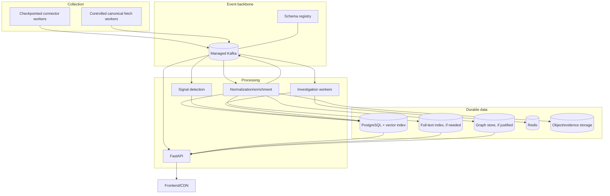

# RhetoriQ Infrastructure

This document separates the infrastructure that exists in the repository from the production topology planned in the roadmap.

## Current state

The repository currently supports local execution of:

- one FastAPI backend process;
- one Vite/React frontend process;
- SQLite and in-process development stores;
- optional Redis for cache, phrase tracking, vectors, and agent memory.

The repository does not currently contain deployable Kafka, Flink, Kubernetes, Terraform, or ArgoCD implementations. Those remain production roadmap work and should not appear in setup instructions as completed resources.

## Target production topology

Kafka remains the central asynchronous event backbone.



## Deployment boundaries

Use independently deployable workers where scaling, failure isolation, or provider policy requires it:

- connector workers grouped by similar rate-limit and secret boundaries;
- canonical-fetch workers with per-domain controls;
- Kafka normalization and enrichment consumers;
- signal-detection consumers;
- investigation workers;
- persistence/indexing consumers;
- API and frontend services.

Do not require one Kubernetes deployment per source by convention. A high-volume public stream may need isolation; several low-volume official APIs may safely share a worker.

## Kafka

Production Kafka should provide:

- multi-zone durability appropriate to the deployment tier;
- TLS in transit and least-privilege topic ACLs;
- schema registry integration;
- controlled topic creation and versioned contracts;
- lag, throughput, and dead-letter monitoring;
- retention aligned with provider storage and deletion requirements.

The topic and event design is defined in [KAFKA.md](KAFKA.md).

## Connector infrastructure

Each production connector needs:

- secrets isolated to that connector’s service account;
- durable checkpoints or cursors;
- distributed rate-limit coordination where replicas share a quota;
- outbound network policy limited to required provider domains;
- timeout, retry, and circuit-breaker configuration;
- last-success, lag, quota, and rejection metrics;
- a kill switch for legal, policy, or provider incidents.

Canonical fetch workers additionally need per-domain concurrency limits, response-size limits, content-type validation, and explicit refusal to bypass paywalls or technical access controls.

## Storage

Adopt production stores incrementally:

1. PostgreSQL for durable document and investigation records.
2. A vector extension/index for semantic retrieval.
3. Redis for caching, coordination, and ephemeral state.
4. A dedicated full-text index only when PostgreSQL search no longer meets requirements.
5. A graph database only when graph traversal requirements justify its operational cost.
6. Object storage for permitted raw evidence, snapshots, and large artifacts.

Backups, encryption, retention, and deletion workflows must be tested before a store becomes authoritative.

## Secrets and configuration

- Store provider credentials in a managed secret service, never in images, Kafka events, source control, or logs.
- Mount or inject only the secrets required by each connector.
- Rotate credentials independently.
- Keep provider base URLs, polling cadence, rate limits, and feature flags in validated configuration.
- Use separate development, staging, and production credentials and quotas.

Potential future secrets include a broad-search API key, Reddit OAuth credentials, Congress.gov/data.gov key, and YouTube API key. They should not be added to required configuration until the corresponding connector is implemented and approved.

## Network and security

- Default-deny service-to-service and outbound network policy where practical.
- Require authenticated, encrypted access to Kafka and durable stores.
- Put the API behind managed TLS, request limits, and an application firewall appropriate to the threat model.
- Prevent connector workers from reaching internal control planes they do not need.
- Redact URLs or query parameters that may contain sensitive values from logs.
- Audit administrative access and production replay operations.

## Observability

Minimum production dashboards:

- connector checkpoint age and last successful collection;
- provider error, throttle, and quota status;
- canonical-fetch success and latency by domain class;
- Kafka producer errors, consumer lag, and dead-letter counts;
- processing throughput and document rejection reasons;
- investigation duration, evidence coverage, and stage failures;
- API latency/error rate;
- store capacity, query latency, and backup health.

Alerts should identify the affected provider or stage without leaking document content.

## Delivery approach

The recommended sequence is:

1. containerize and deploy the existing backend/frontend;
2. add durable PostgreSQL persistence;
3. implement and test source connectors with checkpoints;
4. introduce Kafka contracts and idempotent consumers;
5. split background processing into independently deployable workers;
6. add autoscaling from measured CPU, queue lag, and connector backlog;
7. add GitOps or equivalent automated deployment after manifests exist;
8. add specialized search/graph stores only when justified by measured requirements.

Infrastructure as code should describe real resources checked into the repository. Documentation must not include pretend Terraform modules, Kubernetes manifests, costs, or secret names before those artifacts exist.

## Local development

Backend:

```powershell
cd backend
..\.venv\Scripts\Activate.ps1
uvicorn main:app --reload
```

Frontend:

```powershell
cd frontend
npm run dev
```

Redis is optional for development features. Kafka should be added to local setup when the B3 event contracts and consumers are implemented, not before.

