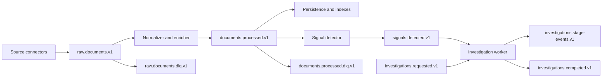

# RhetoriQ Kafka Contracts

Kafka is the target production event backbone for RhetoriQ. It is retained because durable replay, back-pressure, failure isolation, and independently scalable processing are central to the production design.

Kafka is not wired into the current local FastAPI runtime yet. This document defines the contracts to implement in roadmap phase B3.

## Design principles

1. **Replayable ingestion.** A connector can republish from a checkpoint and downstream state can be rebuilt.
2. **Transport-neutral events.** Schemas identify provider and transport without creating a topic for every vendor.
3. **Versioned contracts.** Breaking schema changes use a new event version and, when necessary, a new topic.
4. **Idempotent consumers.** Every event has stable IDs; consumers tolerate redelivery.
5. **Evidence continuity.** Provider metadata, canonical URLs, timestamps, and retrieval limitations survive every stage.
6. **Partial failure.** One connector or consumer failure does not stop unrelated sources.
7. **No hidden state.** Connector checkpoints, retry state, and dead-letter outcomes are observable.

## Event flow



## Topic summary

| Topic | Producer | Primary consumers | Purpose |
|---|---|---|---|
| `raw.documents.v1` | Source connector workers | Normalization/enrichment | Provider records and canonical retrieval results before shared enrichment. |
| `documents.processed.v1` | Normalization/enrichment | Persistence, indexing, signal detection | Validated normalized documents with provenance metadata. |
| `signals.detected.v1` | Signal detector | Investigation scheduler, API updates | Candidate narrative spikes with supporting document IDs and coverage context. |
| `investigations.requested.v1` | API or scheduler | Investigation workers | User-requested and signal-triggered investigation jobs. |
| `investigations.stage-events.v1` | Investigation workers | API, observability, persistence | Progress and inspectable intermediate-stage events. |
| `investigations.completed.v1` | Investigation workers | Persistence and API | Completed evidence-limited reports and artifact references. |
| `*.dlq.v1` | Failing consumers | Operations/replay tooling | Records requiring inspection or controlled replay. |

Use additional source-specific topics only when security, retention, ordering, or extreme volume requires isolation. `raw.reddit`, `raw.gdelt`, and `raw.cspan` are not default contracts because they couple downstream consumers to provider deployment names.

## Common event envelope

All events use a shared envelope:

```json
{
  "event_id": "01J...",
  "event_type": "raw.document.collected",
  "schema_version": 1,
  "occurred_at": "2026-07-16T20:10:00Z",
  "produced_at": "2026-07-16T20:10:02Z",
  "producer": "connector.gdelt",
  "correlation_id": "collection_01J...",
  "causation_id": null,
  "partition_key": "domain:example.com",
  "payload": {}
}
```

Requirements:

- `event_id` is globally unique and stable across producer retries.
- `occurred_at` is source/event time; `produced_at` is Kafka publication time.
- `correlation_id` connects a collection or investigation across stages.
- `causation_id` references the event that caused this event when applicable.
- `schema_version` is validated at producer and consumer boundaries.

## `raw.documents.v1`

This topic carries source-native records and canonical fetch results with enough metadata to normalize and audit them.

```json
{
  "event_id": "01J...",
  "event_type": "raw.document.collected",
  "schema_version": 1,
  "occurred_at": "2026-07-16T20:00:00Z",
  "produced_at": "2026-07-16T20:00:03Z",
  "producer": "connector.gdelt",
  "correlation_id": "collection_01J...",
  "causation_id": null,
  "partition_key": "https://example.com/article",
  "payload": {
    "provider": "gdelt",
    "transport": "api",
    "provider_record_id": "provider-native-id",
    "provider_query": "energy policy",
    "provider_cursor": null,
    "source_url": "https://example.com/article",
    "canonical_url": "https://example.com/article",
    "title": "Example title",
    "body": null,
    "snippet": "Example title",
    "author": null,
    "published_at": "2026-07-16T20:00:00Z",
    "collected_at": "2026-07-16T20:00:02Z",
    "language": "english",
    "content_type": "article",
    "retrieval": {
      "status": "provider_metadata_only",
      "http_status": null,
      "parser_version": null,
      "content_hash": null
    },
    "provider_metadata": {}
  }
}
```

`provider_metadata_only` explicitly marks records that are useful for discovery but do not contain canonical full text.

## `documents.processed.v1`

The processed event embeds the shared `Document` contract plus processing receipts:

```json
{
  "event_id": "01J...",
  "event_type": "document.processed",
  "schema_version": 1,
  "occurred_at": "2026-07-16T20:00:00Z",
  "produced_at": "2026-07-16T20:00:05Z",
  "producer": "document-normalizer",
  "correlation_id": "collection_01J...",
  "causation_id": "01J_RAW...",
  "partition_key": "doc_01J...",
  "payload": {
    "document": {
      "id": "doc_01J...",
      "source_id": "domain:example.com",
      "source_name": "example.com",
      "source_type": "national_news",
      "url": "https://example.com/article",
      "title": "Example title",
      "published_at": "2026-07-16T20:00:00Z",
      "collected_at": "2026-07-16T20:00:02Z",
      "text": "...",
      "snippet": "...",
      "entities": [],
      "phrases": [],
      "metadata": {
        "provider": "gdelt",
        "transport": "api"
      }
    },
    "processing": {
      "normalizer_version": "1",
      "duplicate_of_document_id": null,
      "quality_flags": []
    }
  }
}
```

Provider is metadata; `source_type` describes the evidence, not how it was transported.

## Signal and investigation events

`signals.detected.v1` must include:

- canonical phrase and related phrase IDs;
- observed time window and baseline window;
- spike and confidence components;
- supporting document IDs;
- source and publisher diversity;
- provider coverage and failed-source limitations;
- language stating that origin is not proven.

`investigations.requested.v1` must include the user query or signal ID, requested outputs, time window, source classes, and authorization context.

Stage and completion events should reference persisted artifacts rather than duplicating large bodies of evidence in every event.

## Partitioning

Recommended initial keys:

| Topic | Partition key |
|---|---|
| `raw.documents.v1` | Canonical URL hash or provider plus native record ID. |
| `documents.processed.v1` | Document ID. |
| `signals.detected.v1` | Canonical phrase/narrative ID. |
| Investigation topics | Investigation ID. |

Begin with conservative partition counts based on measured throughput. Do not preserve the old claim that “six scrapers require six partitions”; connector count and partition count are unrelated.

## Delivery and idempotency

- Producers enable idempotence and use acknowledgements appropriate for production durability.
- Consumers commit offsets only after their durable side effect succeeds.
- Persistence uses `event_id` or stable domain IDs as uniqueness keys.
- Transient failures use bounded retries with jitter.
- Permanent schema, policy, or parsing failures go to a dead-letter topic with a redacted error receipt.
- Replays must not send duplicate user notifications or launch duplicate investigations.

Exactly-once business behavior comes from idempotent application writes, not from assuming transport-level exactly-once semantics solve every side effect.

## Retention

Retention is set by data class and provider policy:

- raw events: enough for operational replay, bounded by provider storage terms;
- processed evidence: according to the evidence retention policy;
- signals and investigation events: longer-lived audit trail;
- dead letters: short, access-controlled retention with operational review.

User-generated platform content may require deletion synchronization. A Kafka retention policy must never preserve content longer than the applicable provider agreement allows.

## Security

- Kafka events never contain provider credentials or authorization headers.
- Sensitive topics use least-privilege ACLs and encryption in transit.
- Logs and dead-letter events redact personal or secret values.
- Connector policy metadata remains available to deletion and retention workers.
- Schema registry access and topic creation are controlled in production.

## Observability

Track producer error rate, publish latency, consumer lag, event age, retries, dead-letter volume, checkpoint age, duplicate rate, and end-to-end collection-to-investigation latency. Metrics should be labeled by connector/provider without putting high-cardinality URLs or document IDs in metric labels.

