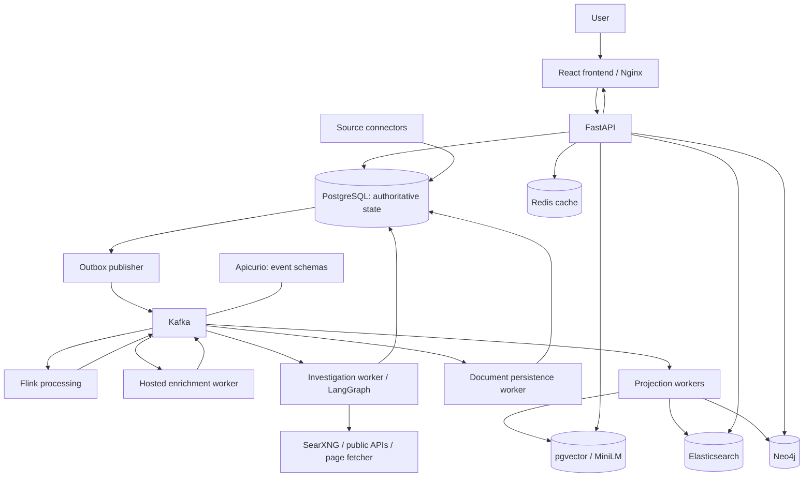

# Before B6: Setup, Technologies, and Runtime Acceptance

Prepared: 2026-09-19. Last updated from this Windows development machine on
2026-09-26.

## Current local progress

### 2026-09-20 — Docker prerequisite cleared

- **Blocker:** Docker Desktop showed "Virtualization support not detected" and its Linux engine could not start.
- **Cause:** CPU virtualization was unavailable to Docker, and the Windows WSL/virtual-machine components were not enabled.
- **Resolution:** Enabled CPU virtualization in UEFI/BIOS, then enabled `Microsoft-Windows-Subsystem-Linux` and `VirtualMachinePlatform` from an elevated PowerShell session and set `hypervisorlaunchtype` to `auto`. After restarting Windows, Docker Desktop reported **Engine running**.
- **Verified:** `docker version` completed locally and displayed both the client and server sections. `docker info` confirmed the Docker Desktop Linux engine is backed by the WSL2 kernel (`6.6.87.2-microsoft-standard-WSL2`) and has 16 CPUs available. `wsl --status` confirmed `docker-desktop` as the default WSL 2 distribution.
- **New resource blocker:** Docker currently reports 6.664 GiB total memory, and the host has 13.8 GiB physical RAM. The host cannot allocate the 16 GiB B5 load-qualification budget while leaving memory for Windows. This machine is suitable for development and reduced local smoke tests, but not for the full B5 load qualification.
- **Elasticsearch prerequisite check:** The Docker/WSL kernel currently reports `vm.max_map_count = 262144`; B5 Elasticsearch requires `1048576`. Do not change it for the current reduced B3/B6 preparation. Set and persistence-test it only in the temporary higher-memory environment used for the B5 runtime qualification.
- **Qualification scope clarification:** The current B5 acceptance gate requires 10,000 distinct seeded documents. The separate [`100k stress test plan`](100k%20stress%20test%20plan.md) describes a future 100,000-documents-per-day capacity claim; it is not the current B5 sign-off corpus or a completed runtime result.
- **Still required:** The Elasticsearch kernel setting and a resource-feasible full-stack environment for the local B6 smoke; the remaining formal B3–B5 runtime-acceptance gates below remain open.

### 2026-09-21 — B3 Kafka control-plane smoke passed

- **Initial blocker:** The Apicurio Registry 3.3.0 process started correctly, but the Compose readiness probe requested `/health/ready` on port 8080 and received HTTP 404.
- **Resolution:** Updated the `schema-registry` Compose health check to use Apicurio 3.x's management port 9000. The broker and registry then became healthy.
- **Verified:** `topic-init` exited with code 0 after creating the 12 versioned primary topics and 12 corresponding DLQ topics. It applied compatibility configuration and registered every schema subject through Apicurio's Confluent-compatible API; all recorded requests returned HTTP 200. A single synthetic, non-live raw-document event was inserted into the real PostgreSQL outbox; `outbox-publisher` published it with zero retries, and an independent consumer schema-decoded the same event from Kafka (`raw.documents.v1`). A synthetic processed-document event was then published and completed once by `document-worker`. An intentional duplicate Kafka delivery of that same event ID was safely skipped by the durable consumer ledger. Finally, an event published while `document-worker` was stopped was consumed exactly once after the worker restarted.
- **Focused automated verification:** `backend/tests/test_b3_event_backbone.py` passed all 10 tests. The first run was blocked only by Windows denying pytest access to an existing shared temp/cache directory; rerunning with an isolated temporary base directory and cache disabled completed successfully. This was a local test-runner permission issue, not a product-test failure.
- **Scope:** This is a successful Kafka/registry, durable-outbox, document-consumer, duplicate-guard, and worker-restart smoke result. It does not close B3: DLQ behavior, controlled replay, broker restart recovery, and the remaining consumer roles are still untested. Raw-document processing additionally requires the B4 Flink runtime.

### 2026-09-26 — Release hardening and PostgreSQL qualification

- **Tooling:** Helm 3.19.0, Terraform 1.13.3, kubectl 1.36.1, and kind 0.33.0
  were reverified directly. AWS CLI v2.37.4 is installed at
  `C:\Program Files\Amazon\AWSCLIV2\aws.exe`; newly opened shells inherit its
  system `PATH` entry.
- **AWS identity boundary:** No standard local AWS profiles or `AWS_*`
  environment credentials were found. `aws sts get-caller-identity` was not
  called, no AWS API operation ran, and the operator identity remains
  unverified.
- **Validation:** The release-candidate regression exercised source `91a95e6`
  and was recorded with the Terraform formatting fix in commit `4efcab2`. With
  disposable PostgreSQL configured, the complete backend suite passed with 386
  passes, 12 optional environment-dependent skips, and zero failures; all 16
  PostgreSQL integration tests also passed separately. Python compilation,
  reproducible event schemas, `npm ci`, 27 frontend tests, the production
  build, zero high-severity audit findings, all three Compose profiles, both
  Helm profiles, Kubernetes schema validation, all 19 PowerShell scripts, and
  all three Terraform states passed without AWS access.
- **Hardening:** Commits `6e8b99e` and `269440d` add missing CI infrastructure
  and image gates, repair PostgreSQL conninfo/query handling, remediate frontend
  dependencies, and make the Flink job compatible with the pinned 2.3 runtime.
- **Boundary:** The complete local regression is recorded. Remote CI has not
  yet been observed green, and the four release images and SHA-256 digests have
  not yet been built from the selected deployment commit. After EKS iteration,
  the complete suite and definitive digests must be reproduced for the final
  deployment identity.

### 2026-09-26 — B4 recorded-provider smoke passed

- **Verified:** The isolated Kafka/Flink acceptance published 20 records and
  received 20 unique processed records with zero failures in 135.31 seconds.
  The JobManager and TaskManager remained healthy and completed checkpoints.
- **Scope:** This closes the basic framed-delivery smoke only. Checkpoint
  recovery under process failure, replay, duplicate/late/out-of-order behavior,
  the paced-load run, retry/budget behavior, and the optional live-provider
  canary remain formal B4 gates.
- **Canonical record:** Current candidate evidence and the ordered remaining
  work are maintained in [AWS Release Readiness](RELEASE_READINESS.md).

### Remaining formal qualification work before claiming B3–B5 acceptance

The B6 chart can be implemented and smoke-tested while these gates remain open,
but neither a local Kubernetes run nor the short-lived EKS showcase closes them.

- **B3 Kafka:** exercise permanent and retryable failures through every required
  DLQ, controlled replay with preserved IDs/artifacts/completion counts, broker
  and registry interruption while the outbox accumulates accepted work, and
  recovery of the remaining role-specific consumers.
- **B4 Flink:** basic framed raw-event delivery through the running Flink job
  and recorded enrichment has passed for 20/20 documents. Still prove its
  retry/budget behavior, ordered/duplicate/out-of-order/late-event handling,
  checkpoint recovery under failure, projection/product freshness, and the
  documented paced-load run. The separate live-provider canary requires
  explicit credentials and positive budget/pricing limits.
- **B5 retrieval:** prove the full specialized-store startup and TLS contract,
  canonical persistence and browser/product queries, target failure and cache
  fallthrough behavior, repair/rebuild/rollback, and the separate
  10,000-document load qualification with integrity, lag, latency, memory/OOM,
  and drain evidence.
- **Evidence:** retain the reports, logs, offsets, DLQ counts, checkpoint IDs,
  resource measurements, image/model identities, and sanitized screenshots
  required by [Testing](TESTING.md) and [Operations](OPERATIONS.md). Mark a
  milestone complete only from that evidence.

This guide collects the software prerequisites, environment configuration, technology overview, architecture flow, and explanation of disposable B3–B5 acceptance before Kubernetes deployment.

B6 is **local Kubernetes deployment**. The repository contains the B3 Kafka backbone, B4 Flink processing, and B5 specialized retrieval implementations, but their formal runtime acceptance remains incomplete. The recorded B3 and B4 smoke evidence does not close the remaining recovery, load, and degradation gates.

The durable sources of truth are the [roadmap](ROADMAP.md),
[operations runbook](OPERATIONS.md), and [testing and acceptance
guide](TESTING.md). This guide does not claim that acceptance has been
performed.

## 1. Software to Install or Verify

The following inventory is a snapshot of commands available on the development machine on the preparation date. Availability on PATH does not prove that a service is running.

| Software | Observed setup | Purpose and next action |
| --- | --- | --- |
| Git | Installed | Source control and identifying deployment versions. |
| Docker Desktop / Compose | Docker client v29.6.2 is installed and the Linux engine was verified running on 2026-09-20. | Keep Linux containers and the WSL 2 backend enabled; `docker version` must show both client and server before Compose or kind work. |
| WSL | Docker Desktop is using the WSL2 kernel and `docker-desktop` distribution. | Linux environment used by Docker on Windows. Recheck after host or Docker updates. |
| Node.js / npm | Node v22.23.2 installed | Frontend dependency installation, development, and builds. |
| Python | v3.13.3 installed | Backend development and tests. |
| kubectl | Installed; active context `kind-rhetoriq-b6` was verified on 2026-09-20. | Inspect and control Kubernetes workloads; recheck nodes and system pods before B6 deployment. |
| kind | v0.33.0 installed; one-node `rhetoriq-b6` cluster verified Ready on 2026-09-20. | Local Kubernetes cluster tool selected for B6. |
| minikube | Not found on PATH | Alternative to kind; choose one local cluster tool. |
| Helm | v3.19.0 installed and on `PATH` | Required by the implemented B6 runtime scripts and chart. |
| Terraform | v1.13.3 installed and on `PATH` | Required for the guarded EKS plans; no AWS-backed plan or apply has run. |
| AWS CLI | v2.37.4 installed; absolute executable verified | Open a new shell, configure an approved SSO profile or IAM credentials privately, and require `aws sts get-caller-identity` to pass before any ECR, EKS, or Terraform provider operation. |

### Recommended immediate installation

The [kind quick-start guide](https://kind.sigs.k8s.io/docs/user/quick-start/) lists this Windows installation option:

```powershell
winget install Kubernetes.kind
```

Use Docker Desktop with **Linux containers and the WSL 2 backend**. Verify hardware virtualization and WSL requirements using the [Docker Windows setup guide](https://docs.docker.com/desktop/setup/install/windows-install/).

Useful read-only checks:

```powershell
docker version
docker compose version
docker info
wsl --status
wsl --list --verbose
kind version
kubectl version --client
kubectl config current-context
```

### Current machine blockers and exact next actions

Docker, WSL 2, kind, and the `rhetoriq-b6` cluster are now working. The Helm
chart exists at `deploy/helm/rhetoriq`; complete the remaining preparation and
runtime gates in this order:

1. Reconfirm `docker version`, `docker info`, `kubectl config
   current-context`, `kubectl get nodes`, and `kubectl get pods -A` after a host
   or Docker restart.
2. Reverify Helm 3.19.0 and Terraform 1.13.3, then rerun the repository static
   gate and both chart profiles at the final candidate commit.
3. Raise and persistence-test `vm.max_map_count=1048576` before attempting the
   full chart. Do not omit Elasticsearch to force a misleading success.
4. Attempt the full single-replica kind smoke only with measured resource
   evidence. Its 6.664 GiB Docker allocation and 13.8 GiB physical RAM cannot
   satisfy the 16 GiB B5 qualification budget; if the complete chart cannot
   run, preserve the evidence and defer the full runtime smoke to EKS.
5. Complete the remaining formal B3, B4, and B5 gates listed above in a
   higher-memory disposable environment; the B5 10,000-document qualification
   is explicitly separate from the B6/EKS demo.
6. Keep Terraform/AWS provisioning, public DNS, provider credentials, and any
   billable action behind explicit approval. B7/B9 implementation artifacts
   may exist, but no AWS deployment or teardown evidence has been recorded.

### Machine resources and Elasticsearch prerequisite

The [operations runbook](OPERATIONS.md) calls for **16 GB RAM and 8 CPUs
allocated to Docker/WSL** for B5 qualification. Its configured steady-state
container memory caps total approximately 13 GiB; these are limits, not measured
usage. Kubernetes adds overhead. A machine with 32 GB total RAM is a practical
preference, not a measured project requirement.

Elasticsearch requires this Linux kernel setting in the Docker/WSL environment:

```text
vm.max_map_count=1048576
```

Verify it survives restarts. Follow [Elastic's Docker production instructions](https://www.elastic.co/docs/deploy-manage/deploy/self-managed/install-elasticsearch-docker-prod) for the applicable Windows/WSL procedure.

Builds need internet access to obtain container images, Python/npm dependencies, the pinned MiniLM weights, and the Flink Kafka connector source.

### What does not need a separate desktop installation

Kafka, Flink, PostgreSQL, Elasticsearch, Neo4j, Redis, Java, and Maven are supplied by our containers or container builds. The Flink image supplies Python 3.12 separately from the backend's Python 3.13 runtime.

Ollama is optional. Choosing it requires installing Ollama and downloading the selected local model. Browser rendering is also optional; its separate renderer image needs browser binaries if enabled.

## 2. Environment Variables and Credentials

An environment variable is a setting passed to a process: for example, a service address, feature switch, password, or API key.

Start local configuration from [`.env.production.example`](../.env.production.example). Use separate untracked files for ordinary local execution and disposable acceptance. Actual acceptance must use fresh test credentials, test volumes, and a local test database, with no production Neon connection or developer provider keys.

### Required local Compose file

Root Compose reads `.env`, not the existing root `.env.local`. The current
Compose validation fails because `POSTGRES_PASSWORD` is missing. Before a
local rehearsal, create an untracked root `.env` from the template and replace
all placeholder secrets with fresh local-only values:

```powershell
Copy-Item .env.production.example .env
```

For the base stack, `.env` must set:

```text
POSTGRES_DB=rhetoriq
POSTGRES_USER=rhetoriq
POSTGRES_PASSWORD=<fresh-local-password>
SEARXNG_SECRET=<long-random-secret>
VITE_API_BASE_URL=http://localhost:8000
```

Do not reuse `DATABASE_URL`, `DATABASE_URL_UNPOOLED`, or provider credentials
from `.env.local` for disposable Compose or B6 acceptance. The root Compose
file constructs its own local PostgreSQL URL from the three `POSTGRES_*`
variables. Do not commit `.env` or copy real credentials into this guide.

### Service secrets and model access

| Variables | What to supply |
| --- | --- |
| `POSTGRES_DB`, `POSTGRES_USER`, `POSTGRES_PASSWORD` | Database name, account, and fresh password. Compose constructs the local `DATABASE_URL`. Disposable B5 acceptance uses `POSTGRES_DB=rhetoriq_b5_test`. |
| `SEARXNG_SECRET` | Long random secret for our self-hosted search service; it is not a paid search API key. |
| `ELASTICSEARCH_PASSWORD` | B5 full-text service password. |
| `NEO4J_PASSWORD` | B5 graph database password. |
| `REDIS_PASSWORD` | B5 cache password. |
| `GEMINI_API_KEY` | Google model access. Live B4 enrichment needs Gemini, including its embedding API. |
| `GROQ_API_KEY` | Backup model access for extraction and investigation work. |
| `GEMINI_MODEL`, `GROQ_MODEL` | Optional model overrides; defaults exist. |

Gemini, Groq, and database variables were present in the local environment files during the preparation check. Presence does not establish validity, quota, or successful connectivity. No secret values belong in this guide.

URL-encode special characters in passwords used within a PostgreSQL connection URL. Keep hosted database TLS settings. The local B5 overlay additionally configures verified TLS and generated local certificate trust.

### Application and service configuration

| Variables | Purpose and intended use |
| --- | --- |
| `DATABASE_URL` | Database connection for API and workers. Use a local disposable database for acceptance; the existing Neon connection belongs to the hosted topology. |
| `DEPLOYMENT_ENV=production`, `DEMO_MODE=false` | Require production persistence and select live application behavior. |
| `RESEARCH_RUNTIME=langgraph`, `RESEARCH_EXECUTION_MODE=kafka` | Graph workflow launched by Kafka investigation consumers. Execution is Kafka-only. |
| `KAFKA_BOOTSTRAP_SERVERS` | Kafka broker address. |
| `KAFKA_SCHEMA_REGISTRY_URL` | Apicurio schema API address. |
| `KAFKA_CLIENT_ID`, `KAFKA_CONSUMER_GROUP_PREFIX` | Client identity and consumer-group naming. |
| `KAFKA_SECURITY_PROTOCOL`, `KAFKA_SASL_MECHANISM`, `KAFKA_SASL_USERNAME`, `KAFKA_SASL_PASSWORD` | Broker security configuration when the chosen broker requires it. The local rehearsal uses plaintext Kafka on its private network. |
| `SEARXNG_BASE_URL` | Private search-service address. |
| `CORS_ALLOW_ORIGINS` | Frontend origins permitted to call the API. |
| `PUBLIC_API_BASE_URL` | API address read by the deployed frontend at container startup. |
| `VITE_API_BASE_URL` | API address for local Vite development; root Compose also uses it to populate the frontend runtime address. |
| `ENABLE_B5_RETRIEVAL` | Enable B5 retrieval after initialization, backfill, and acceptance. Enable it explicitly for the intended B5 test deployment. |
| `ENABLE_POSTGRES_VECTOR_SEARCH` | Enable corpus semantic retrieval after preparation. The B5 overlay sets this to true. |
| `EMBEDDING_LOCAL_ONLY` | Load embedding weights from the local cache. The B5 image preloads MiniLM and enables local-only runtime loading. |
| `ENABLE_FLINK_TRENDING`, `FLINK_AUTO_INVESTIGATE` | Keep false until the relevant runtime gates pass. |
| `BROWSER_RENDERING_ENABLED` | False for the initial public deployment. |
| `BROWSER_SERVICE_URL`, `BROWSER_SERVICE_TOKEN` | Address and authentication for an optional browser-renderer deployment. |
| `CLAIM_VERIFIER_ENABLED`, `CLAIM_VERIFIER_LOCAL_ONLY` | Optional A3 verification and local model-loading policy. If enabled, make its NLI weights available in that deployment. |
| `REQUEST_RATE_LIMIT_PER_MINUTE`, `INVESTIGATION_START_LIMIT_PER_HOUR` | Bound API usage. Current template values are 120 requests/minute and five investigation starts/hour. |
| `REQUEST_RATE_LIMIT_MAX_CLIENTS` | Bounds the in-process client counter map; template value is 10,000. |
| `TRUST_PROXY_HEADERS` | Enable only when requests arrive through the intended trusted proxy. |

The B5 overlay supplies `ELASTICSEARCH_URL`, `ELASTICSEARCH_USERNAME`, `ELASTICSEARCH_CA_CERT`, `NEO4J_URL`, `NEO4J_USERNAME`, `NEO4J_CA_CERT`, `REDIS_URL`, and `REDIS_CA_CERT`. B6 must translate internal addresses to Kubernetes Services and mount the appropriate public CA trust.

The full settings inventory is in [`backend/config.py`](../backend/config.py). Most budgets, timeouts, and retrieval limits have defaults; not every setting needs a manual override.

### Live enrichment startup requirement

The live B4 hosted-enrichment worker requires explicit positive values for all five settings:

```text
ENRICHMENT_REQUEST_BUDGET
ENRICHMENT_SPEND_BUDGET_MICROS
ENRICHMENT_INPUT_PRICE_MICROS_PER_MILLION
ENRICHMENT_OUTPUT_PRICE_MICROS_PER_MILLION
ENRICHMENT_EMBEDDING_PRICE_MICROS_PER_MILLION
```

They bound request counts, reserve model spend, and specify pricing ceilings. Monetary values are micro-US dollars: `1000000` means $1. Price ceilings are micro-US dollars per million tokens.

The committed template sets these to zero, so the live worker intentionally refuses to start until they are configured. Verify current provider prices and quotas before choosing values. Recorded-provider acceptance does not require paid model calls or provider credentials. The bounded live canary is a separate acceptance step.

### Where settings are loaded

- The backend settings loader automatically reads `backend/.env`.
- Root `.env.local` is a separate file; its contents are not automatically loaded by that backend loader.
- Compose reads its selected environment file and injects variables declared in the service definitions.
- Kubernetes will use ConfigMaps for ordinary settings and Secrets or an equivalent secret source for credentials and private keys.

A value present in one file does not mean every process receives it. Inject only the settings required by each service.

For B6, put ordinary non-secret values in ConfigMaps and passwords, API keys,
SASL credentials, and private certificates in Kubernetes Secrets. B6 must
replace Compose hostnames with in-cluster Service DNS names for PostgreSQL,
Kafka, Apicurio, SearXNG, Flink, Elasticsearch, Neo4j, and Redis. Do not make
those data services publicly accessible merely to satisfy internal traffic.

The local backend environment contains legacy Tavily, SerpAPI, Browserbase, and Arize variables. The current runtime has no corresponding configuration integrations, so those services are not prerequisites. `ANTHROPIC_API_KEY` is declared but has no implemented Claude model-client path.

## 3. What Each Technology Does

The tables cover the principal runtime, development, and planned infrastructure technologies. A component being implemented does not mean its live deployment has passed acceptance.

### Frontend

| Technology | General purpose | RhetoriQ role |
| --- | --- | --- |
| React | Interactive browser interfaces. | Dashboard, investigation workspace, reports, evidence, and audit views. |
| TypeScript | Type checking for JavaScript. | Frontend data contracts and component correctness. |
| Vite | Development server and browser-asset builds. | Local UI development and production build. |
| Tailwind CSS | Utility-based styling. | Layout, spacing, colors, and responsive design. |
| React Router | URL-based application navigation. | Dashboard/workspace routing and addressable report tabs. |
| React Flow | Interactive node-and-edge diagrams. | Research workflow and narrative/provenance exploration. |
| Framer Motion | Interface animation. | Transitions and motion behavior. |
| simplex-noise | Procedural noise generation. | Decorative visuals. |
| Fontsource / Space Grotesk | Packaged font assets. | Application typography. |
| Nginx | Static-file serving and HTTP routing. | Serves the compiled frontend in its production container. |

### Backend, Agents, and Acquisition

| Technology | General purpose | RhetoriQ role |
| --- | --- | --- |
| Python | Application programming language. | Backend, workers, research services, and operator commands. |
| FastAPI | HTTP API framework. | Investigation, ingestion, search, receipts, report, and health endpoints. |
| Uvicorn | ASGI application server. | Runs FastAPI in the backend container. |
| Pydantic / pydantic-settings / dotenv | Data validation and configuration loading. | Requests, documents, events, and environment settings. |
| HTTPX | HTTP client. | Source retrieval and provider API calls. |
| tldextract | Domain parsing. | Publisher/domain identification for evidence handling. |
| LangGraph | Stateful workflows with checkpoints and conditional steps. | Bounded research supervision, evidence-gap handling, and durable investigation recovery. |
| Gemini | Hosted model inference and embeddings. | Planning, extraction, analysis, synthesis, optional judging, and B4 embeddings. |
| Groq | Hosted model inference. | Backup extraction and investigation model provider. |
| Ollama | Local model serving. | Optional local investigation-model fallback. |
| Sentence Transformers / MiniLM | Text-to-vector encoding. | Local 384-dimensional corpus embeddings for semantic retrieval. |
| NumPy | Numerical array operations. | Vector calculations and numerical processing. |
| DeBERTa NLI model | Textual support/contradiction assessment. | Optional A3 claim–evidence verification. |
| SearXNG | Self-hosted metasearch. | Public-web discovery leads. Fetched source content and receipts establish evidence. |
| GDELT | Public news discovery API. | Article candidates and metadata. |
| HN Algolia | Search API for Hacker News. | Story/discussion discovery candidates. |
| Federal Register API | First-party government-record access. | Primary-source acquisition. |
| Playwright | Real-browser automation. | Optional isolated retrieval for JavaScript-rendered public pages. |

The implemented GDELT, HN Algolia, and Federal Register connectors require no API keys. Managed search, browser, and observability SaaS are not required.

### Storage and Event Processing

| Technology | General purpose | RhetoriQ role |
| --- | --- | --- |
| PostgreSQL | Durable relational storage and transactions. | Authoritative documents, investigations, receipts, checkpoints, revisions, outbox, and projection state. |
| Neon | Hosted PostgreSQL provider. | Database for the documented public deployment; local Compose provides its own PostgreSQL. |
| psycopg | Python PostgreSQL driver. | Database connections and transactions. |
| pgvector | Vector storage and similarity search in PostgreSQL. | Retrieve corpus evidence by meaning. |
| SQLite | Lightweight file-based database. | Development and test persistence. |
| Kafka | Durable event streams. | Decoupled ingestion, processing, investigations, projections, retries, and replay. |
| confluent-kafka | Kafka client library. | Python event producers and consumers. |
| Apicurio Registry | Schema storage and compatibility management. | Versioned event contracts through its compatible schema API. |
| JSON Schema / jsonschema | Define and validate structured messages. | Validate Kafka event shapes across producers and consumers. |
| Flink / PyFlink | Stateful stream processing with checkpoints. | Document normalization/deduplication, phrase windows, and narrative signals. |
| Elasticsearch | Indexed full-text and exact-phrase search. | B5 lexical evidence retrieval. |
| Neo4j | Relationship storage and graph traversal. | B5 explained reference/provenance paths. |
| Redis | Fast in-memory storage. | Bounded B5 query caching and existing optional cache/memory features. |

The stores answer different questions:

- **PostgreSQL:** What is the authoritative persisted record?
- **pgvector:** Which evidence has similar meaning?
- **Elasticsearch:** Which evidence contains these words or phrases?
- **Neo4j:** How are these documents and evidence relationships connected?
- **Redis:** Can a complete, validated response be reused briefly?

Elasticsearch and Neo4j are derived projections that can be rebuilt from retained canonical inputs. Redis is disposable cache. B4 Gemini embeddings and B5 MiniLM embeddings belong to different embedding spaces; preserve their model identities rather than mixing vectors because their dimensions match.

### Development, Deployment, and Planned Infrastructure

| Technology | General purpose | RhetoriQ role and status |
| --- | --- | --- |
| Docker | Package processes and dependencies into images. | Implemented reproducible service builds. |
| Docker Compose | Run connected containers locally. | Implemented root topology and B4/B5 overlays. |
| pytest / pytest-asyncio | Python testing. | Backend regressions and async behavior checks. |
| Vitest / Testing Library / jsdom | Frontend tests and DOM simulation. | UI logic and component checks. |
| GitHub Actions | Automated repository workflows. | Existing CI; full image delivery and cloud automation are later work. |
| Kubernetes | Container orchestration. | Planned B6 deployment, networking, probes, resources, and storage. |
| kind / minikube | Local Kubernetes clusters. | Planned B6 cluster; choose one. |
| kubectl | Kubernetes command-line client. | Inspect workloads, configuration, logs, and rollout state. |
| Helm | Parameterized Kubernetes packaging. | Implemented B6 chart with `kind` and `eks-demo` profiles. |
| Terraform | Infrastructure as code. | Implemented but unexecuted three-state ephemeral EKS environment. |
| Argo CD | Reconcile cluster deployments with Git. | Planned B7 GitOps deployment and rollback flow. |
| Prometheus | Metrics collection and querying. | Planned B8 throughput, lag, latency, failure, and usage metrics. |
| Grafana | Operational dashboards. | Planned B8 visualization of service health and performance. |
| OpenTelemetry | Standard instrumentation and trace export. | Planned cross-service observability; research traces already use controlled storage. |
| AWS EKS | Managed Kubernetes control plane. | Implemented short-lived portfolio demonstration; not provisioned. |
| Railway / Render | Application hosting platforms. | Railway is the documented public topology; Render is an alternative in the demo strategy. |

The root npm packages `@neon/config` and `@neon/env` support Neon configuration/environment tooling. The Python backend uses psycopg to access PostgreSQL; those npm packages do not run the investigation pipeline.

## 4. How the System Fits Together



This is a conceptual flow: named Kafka topics connect the individual processing stages. A transactional outbox is a database table written in the same transaction as the accepted application operation; its publisher delivers committed records to Kafka. This prevents an accepted request from being lost between the database write and event publication.

### A User Investigation

1. The frontend sends a question to FastAPI.
2. FastAPI persists the request and an outbox event together, then returns an accepted response.
3. The outbox publisher delivers the request event to Kafka.
4. An investigation worker launches LangGraph under a durable lease.
5. Research tools find and fetch sources. Evidence acquisition uses the document pipeline, preserving receipts and provenance.
6. The workflow assesses gaps, performs bounded follow-ups, and builds a cited report or an insufficient-evidence result.
7. PostgreSQL preserves progress and results. The API streams updates through SSE, with frontend polling fallback.
8. Projection workers maintain specialized views used to explore persisted evidence.

### Document Ingestion and Signals

1. Connectors acquire public records and stage raw-document events through the outbox.
2. Kafka feeds the Flink normalization and deduplication branch.
3. An enrichment worker handles requested extraction and hosted embeddings, recording reusable artifacts.
4. Flink processes enriched events and computes stateful phrase windows and signals.
5. Consumers persist canonical documents and maintain retrieval projections.
6. Signals schedule investigations only when automatic investigation is explicitly enabled.

Kubernetes will deploy these processes and their dependencies. It does not replace their application logic or make their correctness automatic.

## 5. What Disposable B3–B5 Acceptance Means

It means **running the real services in an isolated test environment and collecting proof that they work together**, beyond unit tests.

"Disposable" means a separate Docker Compose project with fresh test databases, named volumes, and passwords. It can be removed after evidence has been exported without affecting the ordinary local environment or production Neon database. Preserve test volumes during recovery exercises.

Most checks use recorded hosted-model responses to avoid paid calls. They still use real Kafka, Flink, PostgreSQL, Elasticsearch, Neo4j, Redis, and actual pinned MiniLM inference. The bounded live canary is separate.

### Startup Checks

- Required containers and initialization jobs start successfully.
- TLS trust, credentials, migrations, Kafka topics/schemas, ES mappings, and Neo4j constraints initialize correctly.
- Seeded documents travel through the real pipeline and become searchable.
- A persisted investigation exposes evidence and graph paths and survives reload.
- Dependency readiness, consumer lag, and projection coverage are checked; a running process or heartbeat alone is insufficient.

### Recovery and Correctness Checks

- Crash selected workers or services, restart them, and verify correct continuation.
- Replay events without duplicating canonical results or semantic relationships.
- Exercise crashes after target writes but before delivery acknowledgement.
- Check stale revisions, equal-revision conflicts, and out-of-order delivery.
- Withdraw/restore documents and verify search, graph, and cache behavior, including stopped projection workers.
- Inject projection drift, detect it, and perform bounded repair.
- Rebuild isolated generations, catch up concurrent mutations, activate, and roll back consistently.
- Verify explicit degradation during ES/Neo4j/Redis outages and preserve evidence eligibility rules.

### B5 Load Qualification

The [B5 acceptance section](TESTING.md#b5-actual-stack-acceptance) prescribes:

| Item | Required experiment or target |
| --- | --- |
| Corpus | 10,000 distinct seeded documents. |
| Providers and stores | Recorded hosted enrichment, real Kafka/Flink/stores, and actual pinned MiniLM. |
| Warm-up | Preload/warm the model and initial corpus before measured windows. |
| Sustained ingestion | 100 documents/minute for 30 minutes. |
| Burst ingestion | 500 documents/minute for five minutes. |
| Query concurrency | Ten concurrent query clients during ingestion. |
| Integrity | No lost canonical records or duplicate semantic relationships. |
| Resources | No memory-limit kills. |
| Backlog | No sustained growth; drain within ten minutes after the measured burst. |
| Projection freshness | Target p95 processed-persistence-to-projection freshness at most 30 seconds. |
| Lexical/graph latency | Target uncached p95 at most one second. |
| Hybrid/path latency | Target p95 at most two seconds. |

Measure persistence and projection rates, not only raw publishing. Record raw-to-search latency separately, including Flink checkpoints, and separate cache-hit/cache-miss distributions. Missing query, memory/OOM, drift, backlog, or embedding-coverage measurements cannot qualify the run.

This demonstrates measured capacity in a controlled experiment. It is not proof of continuous production scale or a daily ingestion claim.

### Acceptance Outputs

Retain JSON reports, container memory/OOM evidence, Kafka offsets/lag/DLQs, Flink job/checkpoint evidence, canonical counts/hashes, projection coverage, repair/rebuild/rollback results, and browser screenshots/traces. Record machine allocation, application image identities, model revision, and generation manifest.

The bounded live canary acquires at most 20 actual documents under explicit provider limits, preserves real acquisition receipts, runs the publication gate, then restarts and reloads the investigation. Record provider usage and failures without credentials.

Use the executable procedures in [Operations](OPERATIONS.md). The
[B5 acceptance scenario matrix](TESTING.md#scenario-matrix) defines full
sign-off; a startup smoke report alone does not complete the milestone.

### Why Complete This Before B6?

Kubernetes adds networking, scheduling, persistent-volume, and rollout concerns. Compose acceptance first establishes that our services and data contracts work before adding those concerns.

This work does not deploy publicly or test against production. Its result is saved evidence that the underlying topology is qualified for B6.

## 6. Readiness Checklist and Deployment Order

- [x] Start Docker Desktop's Linux engine and verify WSL 2, `docker version`, and `docker info`. Completed 2026-09-20: Docker's Linux engine is running; `docker version` reports its server; `docker info` reports the WSL2 Linux engine; and `wsl --status` reports `docker-desktop` on WSL 2.
- [~] Allocate 8 Docker CPUs and 16 GB RAM; verify the Elasticsearch kernel setting survives restart. Docker has 16 CPUs but only 6.664 GiB RAM as of 2026-09-20, while the host has 13.8 GiB physical RAM. Do not attempt the full B5 load qualification on this machine; use a reduced local smoke topology or a higher-memory temporary environment for that gate.
- [x] Install kind (preferred) or minikube, create a cluster, and verify the kubectl context and nodes. Completed 2026-09-20: `kind v0.33.0` created the one-node `rhetoriq-b6` cluster; the active context is `kind-rhetoriq-b6`; its control-plane node is `Ready`; and all observed system pods were `Running` with zero restarts.
- [x] Create untracked `.env` from `.env.production.example`; provide fresh `POSTGRES_PASSWORD` and `SEARXNG_SECRET` at minimum. Completed 2026-09-20: the ignored root `.env` was created from the template, configured with fresh local-only values, and passed `docker compose config --quiet` without output.
- [x] Use fresh local-only credentials, volumes, and database state; do not use the Neon URLs in `.env.local`. Completed 2026-09-21: the B3 smoke ran against the root Compose PostgreSQL service and its local `postgres-data` volume, using the root `.env` variables. No Neon URL was supplied to the Compose services.
- [~] Build the root Compose images and verify pinned MiniLM loading. The root `docker compose build` completed successfully on 2026-09-21. Pinned MiniLM is built through the opt-in B5 overlay and remains deferred with the full B5 acceptance run because this host cannot meet its 16 GiB qualification budget.
- [~] Complete B3 actual event delivery, replay, and recovery checks. The Kafka/Apicurio control plane, PostgreSQL-outbox delivery, document-consumer path, durable duplicate guard, and worker-restart catch-up passed on 2026-09-21 using synthetic local events. All primary/DLQ topics and schemas initialized; the raw event was schema-decoded from Kafka; a processed event completed once; its duplicate was skipped; and a published event was caught up after the consumer restart. DLQ behavior, controlled replay, broker restart recovery, and the remaining consumer paths remain.
- [~] Complete B4 actual Flink delivery, checkpoint, recovery, and load checks. The 20-document recorded-provider delivery smoke passed 20/20 with completed checkpoints on 2026-09-26. Failure recovery, duplicate/late/out-of-order behavior, paced load, retry/budget evidence, and the optional live-provider canary remain.
- [ ] Complete B5 startup, persisted product/browser, failure, repair, rebuild, rollback, and load checks.
- [ ] If the live enrichment canary is in scope, configure a valid Gemini key and all five positive `ENRICHMENT_*` budget/pricing settings; use Groq only if desired as the backup provider.
- [ ] Export acceptance evidence and record gate sign-off.
- [ ] Build and record immutable backend, frontend, Flink, and B5 image digests; make them available to kind's nodes or a local registry.
- [x] Implement B6 manifests/Helm chart: `deploy/helm/rhetoriq` now contains shared chart templates plus `kind` and `eks-demo` values profiles, with namespaces, configuration, services, storage, jobs, workloads, ingress, certificates, policies, and resource contracts. This is implementation evidence only; it has not yet passed a local kind runtime smoke.
- [ ] Run the B6 kind preflight: verify Helm/chart rendering, node resources, image availability, `vm.max_map_count=1048576`, storage behavior, and actual NetworkPolicy enforcement.
- [ ] Deploy the full seeded end-to-end topology to kind and collect the documented health, replay, persistence, search/path, reload, recovery, memory, and OOM evidence. Stop without disabling components if the host cannot fit it.

The B6 handoff must preserve PostgreSQL data, Kafka logs, Flink checkpoints/savepoints, Elasticsearch data, Neo4j data, and certificate material. Redis remains disposable cache. Public CA trust can be a ConfigMap; private keys require Secrets or equivalent secure provisioning. Load or publish application images into the local cluster and record immutable image identities.

Local B6 requires no AWS account or cloud purchase. Later work adds
Terraform/GitOps in B7 and observability in B8. The approved cloud strategy is a
short-lived AWS showcase plus an affordable separate public demo; see
[Deployment](DEPLOYMENT.md#ephemeral-aws-portfolio-demonstration).

The public demo still needs the current Kafka/worker execution dependencies unless a lighter application topology is deliberately implemented. The earlier frontend/API/database-only deployment does not satisfy the current investigation execution contract.

## 7. AWS Deployment Handoff

Use [AWS Release Readiness](RELEASE_READINESS.md) for the canonical completed
evidence and ordered remaining checklist. The complete local regression is
recorded against source `91a95e6` with evidence committed at `4efcab2`. If the
selected deployment source changes, rerun every affected gate. Before AWS
provisioning, complete the practical local B3/B4 gates and verify AWS identity
from a newly opened shell. AWS CLI v2 is installed, but no profile or
credentials are configured and no AWS identity has been verified. Remote CI
observation is explicitly deferred until after the initial private deployment;
it must pass for the frozen final commit before public exposure or final
release sign-off. After foundation creates the four immutable ECR repositories,
an approved GitHub Actions run must build and push all four Linux/AMD64 images
from one explicit source SHA and verify their registry digests before application
deployment. Do not force the full B5 qualification onto this resource-constrained
workstation.

Then provide the approved AWS identity and underlying IAM role ARN, confirmed
region, operator `/32` CIDR, globally unique state-bucket name,
owner/run/commit/deadline tags, and confirmed Budget notification email.
Initial private deployment does not require DNS inputs or application
`allowed_cidrs`. The exact guarded
plan/apply, image push, Secret upload, Helm deployment, smoke/evidence, recovery,
and reverse-order teardown commands live only in [B6 Operations](B6_OPERATIONS.md).
Deploy the complete topology initially without public application ingress and
use EKS for the remaining formal B3–B5 scenarios. Fix locally, publish new
immutable digests, redeploy, and rerun affected gates until one final commit and
four final digests pass the complete regression and CI. Enable restricted
public HTTPS only after that private qualification loop is stable.
Public URL, SSE, persistence, reload/redeploy, replay, health, rollback, and
release-identity proof remain in [Deployment](DEPLOYMENT.md). Do not duplicate
those commands here.
