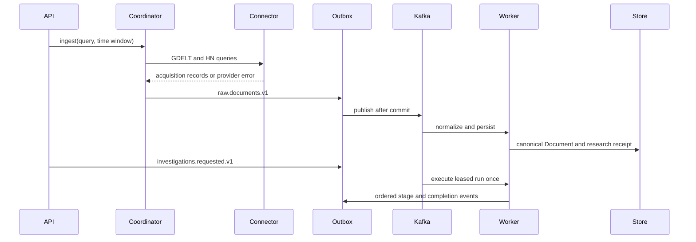

# RhetoriQ Services

This document describes the service boundaries that exist in the repository and the worker boundaries planned for production. It does not use “scraper” as the generic name for collection services; collection is performed by source connectors with different transports.

## Current runtime

The application is split into the FastAPI service, transactional outbox publisher, four role-scoped Kafka consumer services, PostgreSQL/pgvector, Apache Kafka, Apicurio Registry, SearXNG, and the frontend. The API never runs accepted ingestion or investigation jobs synchronously. A small in-process trending refresh remains separate from the B3 event backbone.

| Area | Location | Responsibility |
|---|---|---|
| API | `backend/main.py`, `backend/api/` | HTTP routes, validation, and application startup. |
| GDELT connector | `backend/services/gdelt.py` | Query GDELT DOC 2.0 and normalize article metadata. |
| HN connector | `backend/services/hn_ingestion.py` | Query the Algolia HN API for stories. |
| Ingestion coordinator | `backend/services/ingestion.py` | Run current connectors and atomically stage raw events through the outbox. |
| Search provider boundary | `backend/services/search_provider.py` | SearXNG discovery with explicit unavailable/fallback diagnostics. |
| Federal Register client | `backend/services/federal_register.py` | First-party public-record retrieval, receipts, policy, retries, and pagination. |
| Discovery agent | `backend/agents/discovery_agent.py` | Generate queries, deduplicate candidates, fetch pages, and normalize evidence. |
| Page fetcher | `backend/services/page_fetcher.py` | Retrieve canonical HTML with redirect, timeout, content-type, and cache handling. |
| Document normalizer | `backend/services/document_normalizer.py` | Map HTML and provider metadata into the shared `Document` model. |
| Trending pipeline | `backend/services/trending_*.py` | Discover, rank, cache, and serve live narrative topics. |
| Event contracts/runtime | `backend/models/events.py`, `backend/events/`, `backend/services/event_*.py` | Schemas, topics, outbox, consumers, retries, DLQs, replay, and health. |
| Investigation pipeline | `backend/agents/`, `backend/services/autonomous_research.py` | Consume queued requests and build evidence-limited artifacts under durable leases. |
| Persistence | repository, store, cache, and Redis modules | Development documents, investigations, cache, vectors, and memory. |
| Frontend | `frontend/` | Investigation workspace and narrative views. |

## Current collection sequence



Provider errors are isolated and returned as partial failures. A failed source must not discard successful records from another source.

## B2 agent research-tool boundary

B2 provides broad web search, canonical-page retrieval, internal-corpus recall, and the Federal Register first-party public-record API. The planner selects a tool per evidence gap. Tools return transport-neutral acquisition records and receipts; the Kafka document pipeline owns normalization and persistence. Non-storing source searches remain synchronous reads, but storing research evidence does not bypass the event backbone.

The research-tool boundary must preserve:

- query, provider, source-native identifier, and result-rank metadata;
- canonical URL, publication and collection timestamps, and retrieval receipts;
- bounded retries, per-provider rate limits, deduplication, and partial failures;
- source-policy decisions and discovery-versus-evidence status.

## Future scheduled connector boundary

When continuous monitoring is required, scheduled connectors should share:

- capability metadata;
- query or incremental collection requests;
- cursor/checkpoint persistence;
- pagination and bounded retries;
- provider-aware rate limiting;
- normalized batch results with partial errors;
- health, lag, and quota metrics;
- retention and deletion policy hooks.

A connector name identifies the provider (`gdelt`, `hn_algolia`, `rss`, `congress`); it must not determine the evidence source type. A GDELT result, for example, can represent national news, local news, commentary, or a blog.

## Kafka workers

These workers are deployable in `compose.yml`:

| Worker | Input | Output | Notes |
|---|---|---|---|
| Connector workers | APIs, feeds, streams, approved URLs | `raw.documents.v1` | Independently checkpointed and scalable. |
| Normalization worker | Raw document events | `documents.processed.v1` | Validates, deduplicates, classifies, and enriches. |
| Signal worker | `signals.detected.v1` | Authorized investigation requests | Idempotently schedules only signals with `auto_investigate=true`. |
| Persistence workers | Processed events and artifacts | Durable stores/indexes | Idempotent writes keyed by event/document ID. |
| Investigation worker | User requests or detected signals | Stage events and completed reports | Executes supervised research loops. |
| Projection worker | Stage and completion events | Consumer delivery ledger | Projects/acknowledges durable audit events without duplicating authoritative state. |
| API service | Durable stores and outbox | REST/SSE responses | Returns HTTP 202 for stored ingestion and investigation execution. |

The production deployment may group low-volume connectors into one worker or isolate high-volume/regulated connectors. Deployment topology should follow scaling and compliance needs, not a rule that every source requires its own microservice.

## Autonomous research runtime

The LangGraph workflow is implemented and is launched exclusively by the `investigations.requested.v1` consumer. It retains normalization, retrieval, receipts, confidence, durable stage mutations, leases, recovery, and workspace services.

The graph supervisor will choose among:

- self-operated search adapters for broad discovery and coverage comparison;
- a self-operated browser adapter for bounded public-browser research;
- the existing canonical-page fetcher and internal corpus retrieval.

Each adapter must preserve provider and query metadata, use bounded retries, respect source and search-engine policies, and return discovery records rather than treating snippets as complete evidence. Graph runs are traced and evaluated in RhetoriQ-controlled storage; no managed observability SaaS is required.

## Later RSS connector

The planned feed worker should use conditional requests, checkpoint GUIDs/canonical URLs, preserve feed metadata, and hand off article URLs to canonical retrieval only when necessary. Feed polling intervals are per-feed configuration, not a hard-coded global 60-second loop.

## Official-source tools

Congress.gov, Federal Register, agency feeds, and other first-party public records should be available to the investigator as a distinct, agent-selectable source class. They replace the old undocumented assumption that a public C-SPAN transcript API can supply all political speech evidence.

## Later platform connectors

- Bluesky should use Jetstream or another documented AT Protocol interface.
- Reddit must use approved official API access and implement removal/retention requirements.
- YouTube should use the Data API for discovery and only ingest captions/transcripts when access and terms permit it.
- No platform connector may fall back to evading authentication, rate limits, paywalls, or technical access controls.

## Running the current application

Backend:

```powershell
cd backend
..\.venv\Scripts\Activate.ps1
pip install -r requirements.txt
uvicorn main:app --reload
```

Frontend:

```powershell
cd frontend
npm install
npm run dev
```

Tests:

```powershell
pytest backend/tests
cd frontend
npm run build
```

Full local stack:

```powershell
$env:POSTGRES_PASSWORD="<local-secret>"
$env:SEARXNG_SECRET="<local-secret>"
docker compose up --build -d
docker compose ps
```

Kafka, Apicurio, topic initialization, the outbox publisher, all event workers, PostgreSQL, SearXNG, API, and frontend are defined in the root Compose file. B4 supplies Flink processing; B5 adds Elasticsearch, Neo4j, pinned MiniLM/pgvector, Redis query caching and independent projection workers through `infra/b5/compose.b5.yml`. Actual runtime acceptance remains pending. Kubernetes belongs to B6. See [B5 operations](B5_OPERATIONS.md) for encrypted connections, initialization, health, recovery and resource limits.

## Health and observability

`GET /api/research/health` covers API dependencies plus Kafka broker/registry availability, outbox backlog, publish/consume retry counts, consumer-group state and lag, and per-topic DLQ depth. Provider health includes explicit fallback information. Future recurring connectors should also add:

- last attempted and successful collection time;
- current checkpoint or cursor age;
- records read, accepted, deduplicated, and rejected;
- retry and rate-limit counts;
- quota remaining when exposed by the provider;
- canonical-fetch success by domain;
- deletion-sync lag where provider policy requires it.
