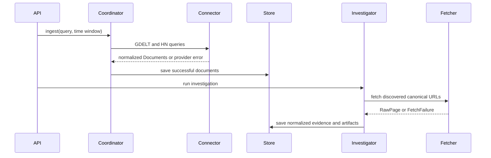

# RhetoriQ Services

This document describes the service boundaries that exist in the repository and the worker boundaries planned for production. It does not use “scraper” as the generic name for collection services; collection is performed by source connectors with different transports.

## Current runtime

The current backend runs as one FastAPI process with modular agents and services. In non-demo mode, an in-process background thread periodically refreshes trending data. These modules can later be separated into workers without changing their core contracts.

| Area | Location | Responsibility |
|---|---|---|
| API | `backend/main.py`, `backend/api/` | HTTP routes, validation, and application startup. |
| GDELT connector | `backend/services/gdelt.py` | Query GDELT DOC 2.0 and normalize article metadata. |
| HN connector | `backend/services/hn_ingestion.py` | Query the Algolia HN API for stories. |
| Ingestion coordinator | `backend/services/ingestion.py` | Run current connectors, persist partial successes, and report errors. |
| Search provider boundary | `backend/services/search_provider.py` | Abstract discovery and enrichment search; currently unconfigured. |
| Discovery agent | `backend/agents/discovery_agent.py` | Generate queries, deduplicate candidates, fetch pages, and normalize evidence. |
| Page fetcher | `backend/services/page_fetcher.py` | Retrieve canonical HTML with redirect, timeout, content-type, and cache handling. |
| Document normalizer | `backend/services/document_normalizer.py` | Map HTML and provider metadata into the shared `Document` model. |
| Trending pipeline | `backend/services/trending_*.py` | Discover, rank, cache, and serve live narrative topics. |
| Investigation pipeline | `backend/agents/`, `backend/services/research_loop_runner.py` | Plan retrieval lanes and build evidence-limited artifacts. |
| Persistence | repository, store, cache, and Redis modules | Development documents, investigations, cache, vectors, and memory. |
| Frontend | `frontend/` | Investigation workspace and narrative views. |

## Current collection sequence



Provider errors are isolated and returned as partial failures. A failed source must not discard successful records from another source.

## Source connector boundary

Production connectors should share:

- capability metadata;
- query or incremental collection requests;
- cursor/checkpoint persistence;
- pagination and bounded retries;
- provider-aware rate limiting;
- normalized batch results with partial errors;
- health, lag, and quota metrics;
- retention and deletion policy hooks.

A connector name identifies the provider (`gdelt`, `hn_algolia`, `rss`, `congress`); it must not determine the evidence source type. A GDELT result, for example, can represent national news, local news, commentary, or a blog.

## Planned workers

These are roadmap targets, not current deployable directories:

| Worker | Input | Output | Notes |
|---|---|---|---|
| Connector workers | APIs, feeds, streams, approved URLs | `raw.documents.v1` | Independently checkpointed and scalable. |
| Normalization worker | Raw document events | `documents.processed.v1` | Validates, deduplicates, classifies, and enriches. |
| Signal worker | Processed documents | `signals.detected.v1` | Maintains baselines and emits evidence-backed spikes. |
| Persistence workers | Processed events and artifacts | Durable stores/indexes | Idempotent writes keyed by event/document ID. |
| Investigation worker | User requests or detected signals | Stage events and completed reports | Executes supervised research loops. |
| API service | Durable stores and events | REST/WebSocket responses | Does not directly poll source providers. |

The production deployment may group low-volume connectors into one worker or isolate high-volume/regulated connectors. Deployment topology should follow scaling and compliance needs, not a rule that every source requires its own microservice.

## Broad search provider

The immediate service gap is `build_search_provider()`, which currently returns `UnconfiguredSearchProvider`.

The first implementation should:

- satisfy the existing `SearchProvider.search()` contract;
- translate time windows and source hints where supported;
- preserve provider rank, score, query, and metadata;
- use Redis caching only within provider storage terms;
- retry 429 and transient 5xx responses with bounded backoff;
- return discovery records rather than pretending snippets are complete evidence;
- allow separate discovery and enrichment providers.

## RSS connector

The planned feed worker should use conditional requests, checkpoint GUIDs/canonical URLs, preserve feed metadata, and hand off article URLs to canonical retrieval only when necessary. Feed polling intervals are per-feed configuration, not a hard-coded global 60-second loop.

## Official-source connectors

Congress.gov, Federal Register, agency feeds, and other first-party public records should be their own source class. They replace the old undocumented assumption that a public C-SPAN transcript API can supply all political speech evidence.

## Platform connectors

- Bluesky should use Jetstream or another documented AT Protocol interface.
- Reddit must use approved official API access and implement removal/retention requirements.
- YouTube should use the Data API for discovery and only ingest captions/transcripts when access and terms permit it.
- No platform connector may fall back to evading authentication, rate limits, paywalls, or technical access controls.

## Running the current application

Backend:

```powershell
cd backend
..\.venv\Scripts\Activate.ps1
pip install -r requirements.txt
uvicorn main:app --reload
```

Frontend:

```powershell
cd frontend
npm install
npm run dev
```

Tests:

```powershell
pytest
cd frontend
npm run build
```

Kafka, Flink, connector worker processes, and production databases should not be included in local startup instructions until their implementations and manifests exist.

## Health and observability

Current health endpoints cover the API, embeddings, and optional Redis capabilities. Production connector health should add:

- last attempted and successful collection time;
- current checkpoint or cursor age;
- records read, accepted, deduplicated, and rejected;
- retry and rate-limit counts;
- quota remaining when exposed by the provider;
- canonical-fetch success by domain;
- deletion-sync lag where applicable;
- Kafka producer lag and dead-letter counts after event-driven ingestion is implemented.

